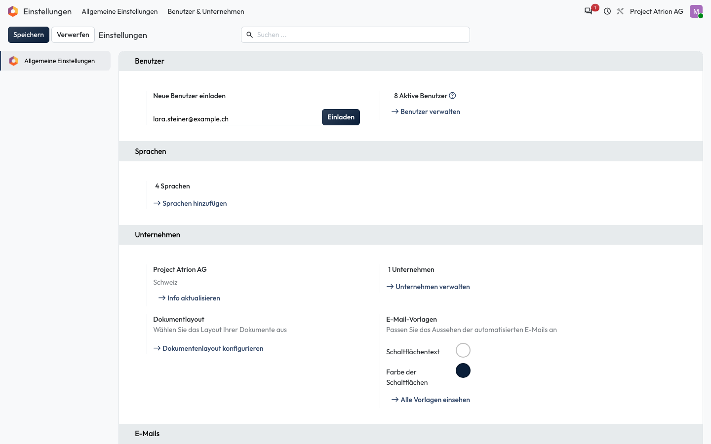

# Benutzer:in einladen

Eine neue Person per E-Mail zu Atrion einladen.

## Wer darf das

Nur die Administration (Rolle **Administrator** im Benutzerformular).

## Schritte

1. Öffne **Einstellungen**. Gib unter **Neue Benutzer einladen** die E-Mail-Adresse ein und klicke auf **Einladen**. Die Person erhält eine E-Mail, mit der sie ihr Passwort setzt.

    

## Hinweise

- Ausstehende Einladungen erscheinen darunter, bis die Person sich zum ersten Mal anmeldet.
- Rechte vergibst du danach im Benutzerformular, siehe [Zugriffsrechte setzen](zugriffsrechte-setzen.md).
