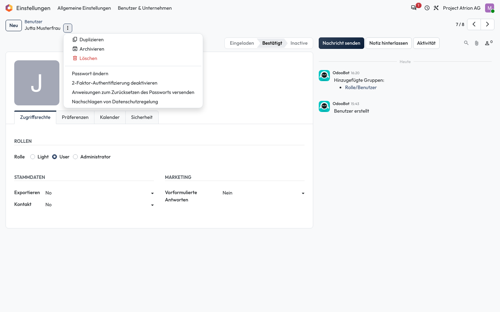
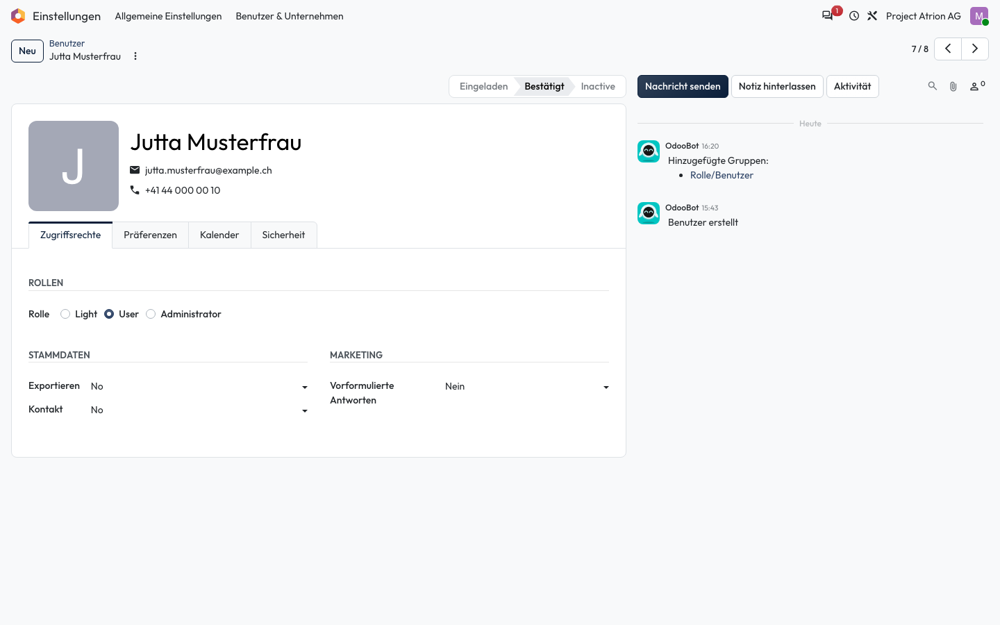

# Passwort einer Person zurücksetzen

Für eine Person ein neues Passwort setzen oder ihr einen Link zum Zurücksetzen senden.

## Wer darf das

Nur die Administration (Rolle **Administrator** im Benutzerformular).

## Schritte

1. Öffne die Person unter **Einstellungen › Benutzer & Unternehmen › Benutzer** und klicke neben dem Titel auf **⋮**. Wähle **Passwort ändern** oder **Anweisungen zum Zurücksetzen des Passworts versenden**.

    

2. Bei **Passwort ändern** bestätigst du zuerst mit deinem eigenen Passwort. Gib dann das neue Passwort ein und klicke auf **Passwort ändern**.

    

## Hinweise

- Sicherer ist der Link per E-Mail: So kennt nur die Person selbst ihr Passwort.
