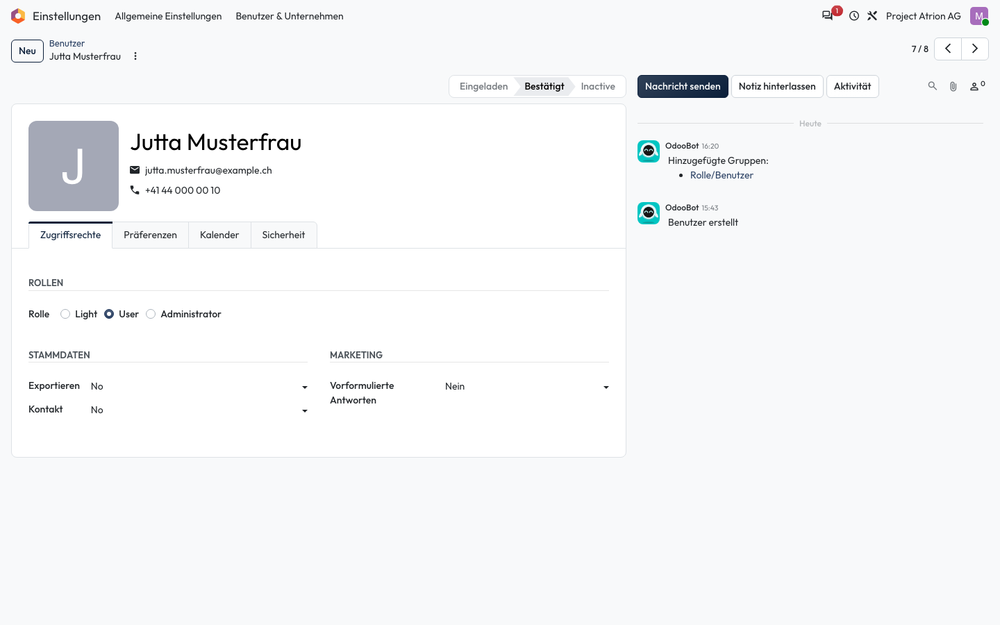

# Zugriffsrechte setzen

Festlegen, was eine Person in Atrion sehen und tun darf.

## Wer darf das

Nur die Administration (Rolle **Administrator** im Benutzerformular).

## Schritte

1. Öffne **Einstellungen › Benutzer & Unternehmen › Benutzer** und die Person. Wähle im Reiter **Zugriffsrechte** unter **Rolle** **Light**, **User** oder **Administrator** und passe darunter die Rechte je Bereich an.

    

## Hinweise

- Die Änderungen gelten ab dem nächsten Seitenaufruf der Person.
- Weitere Rechtebereiche erscheinen, sobald zusätzliche Apps installiert sind.
