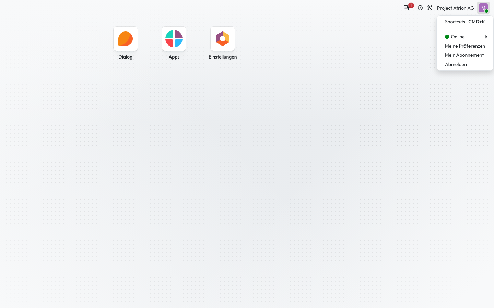
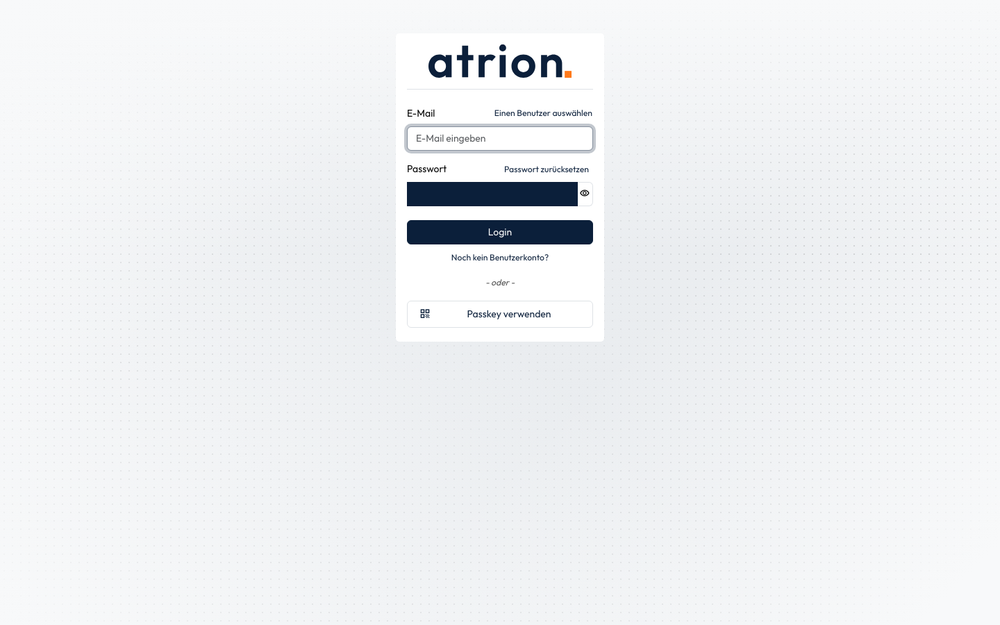

# Abmelden

Die Sitzung in diesem Browser beenden.

## Wer darf das

Alle angemeldeten Personen.

## Schritte

1. Klicke oben rechts auf dein Profilbild und wähle **Abmelden**.

    

2. Du bist abgemeldet und siehst wieder die Anmeldeseite.

    

## Hinweise

- Um dich auf allen Geräten gleichzeitig abzumelden, siehe [Von allen Geräten abmelden](alle-geraete-abmelden.md).
