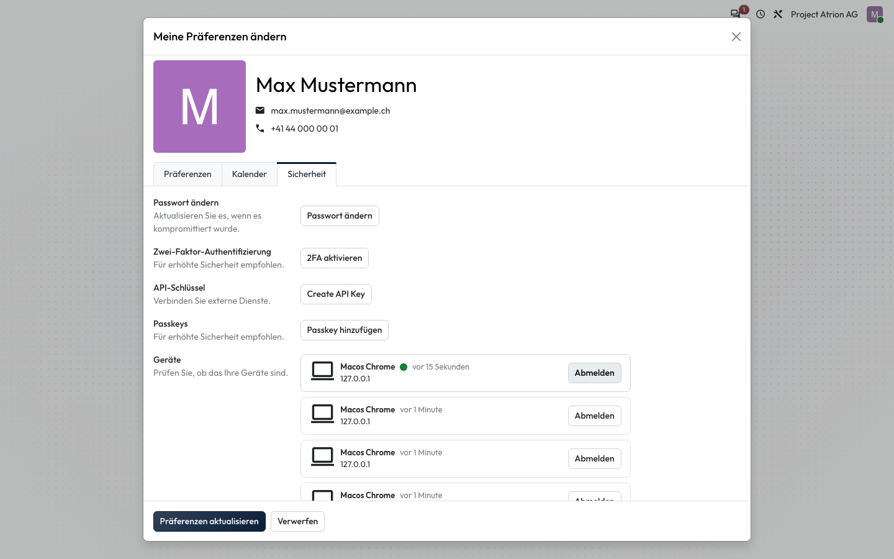

# Von allen Geräten abmelden

Alle offenen Sitzungen beenden, zum Beispiel wenn ein Gerät verloren ging.

## Wer darf das

Alle angemeldeten Personen.

## Schritte

1. Öffne über dein Profilbild **Meine Präferenzen**, Reiter **Sicherheit**. Unter **Geräte** siehst du alle angemeldeten Browser. Mit **Abmelden** beendest du eine einzelne Sitzung, mit **Von allen Geräten abmelden** alle.

    

## Hinweise

- Nach dem Abmelden von allen Geräten musst du dich auch im aktuellen Browser neu anmelden.
