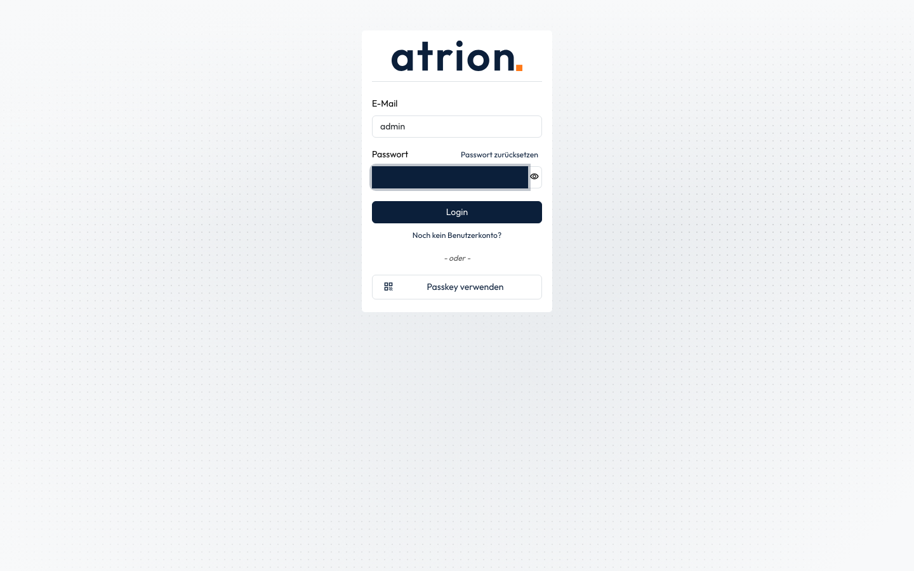

# Anmelden

Mit E-Mail und Passwort bei Atrion anmelden.

## Wer darf das

Alle Personen mit einem Benutzerkonto.

## Schritte

1. Öffne die Adresse deiner Atrion-Instanz. Es erscheint die Anmeldeseite.

    

2. Gib deine **E-Mail** und dein **Passwort** ein und klicke auf **Login**.

    

3. Nach der Anmeldung siehst du die Startseite mit deinen Apps.

    

<!-- video -->

<iframe src="https://player.vimeo.com/video/1234424919?dnt=1&title=0&byline=0&portrait=0" title="Video: Anmelden" allow="fullscreen; picture-in-picture" loading="lazy"></iframe>

<!-- /video -->

## Hinweise

- Mit dem Auge neben dem Passwortfeld blendest du das Passwort ein und aus.
- Ist die Zwei-Faktor-Anmeldung eingeschaltet, fragt Atrion nach dem Passwort zusätzlich nach dem Code aus deiner Authenticator-App.
- Passwort vergessen? Siehe [Passwort zurücksetzen](passwort-zuruecksetzen.md).
