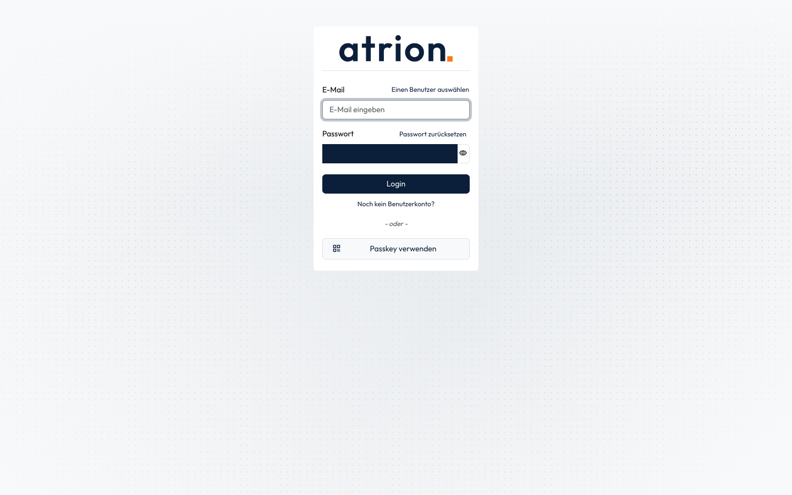
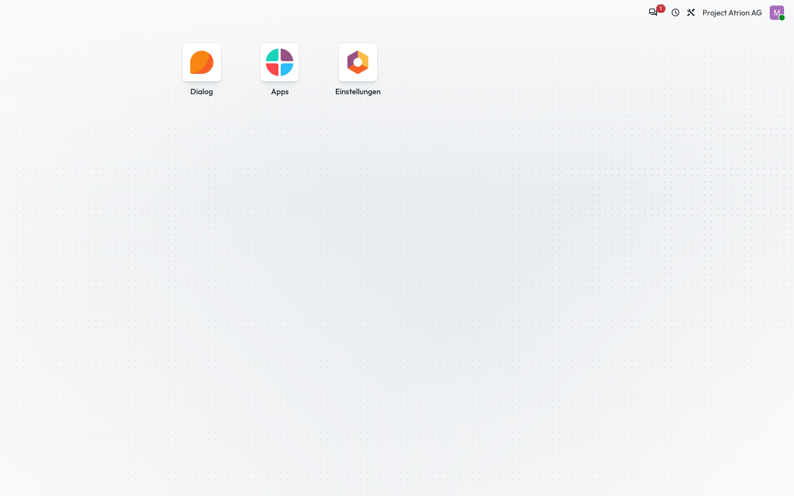

# Mit Passkey anmelden

Ohne Passwort anmelden, mit dem Passkey deines Geräts.

## Wer darf das

Alle Personen mit eingerichtetem Passkey.

## Schritte

1. Klicke auf der Anmeldeseite auf **Passkey verwenden**. Dein Gerät fragt nach Fingerabdruck, Gesicht oder PIN.

    

2. Nach der Bestätigung bist du angemeldet und siehst die Startseite.

    

## Hinweise

- Die E-Mail musst du nicht eingeben; der Passkey weiss, zu welchem Konto er gehört.
- Klappt es nicht, meldest du dich wie gewohnt mit E-Mail und Passwort an.
