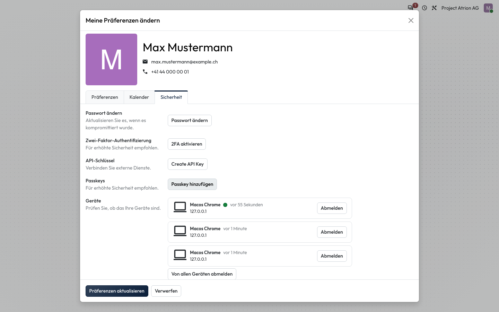
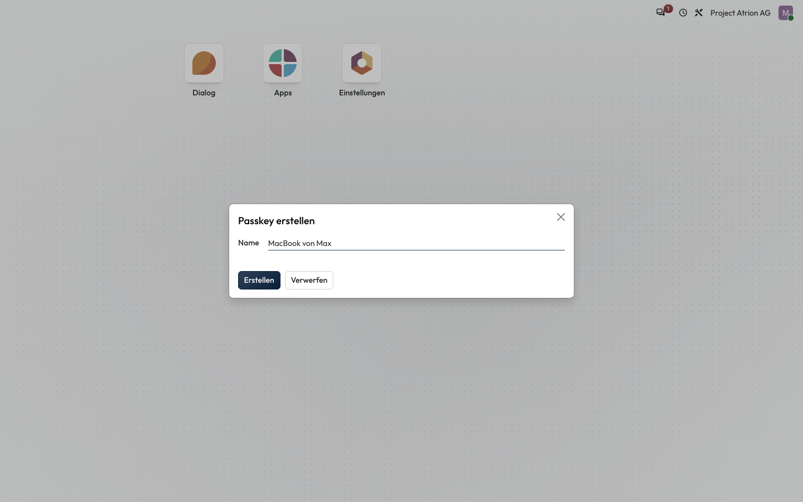
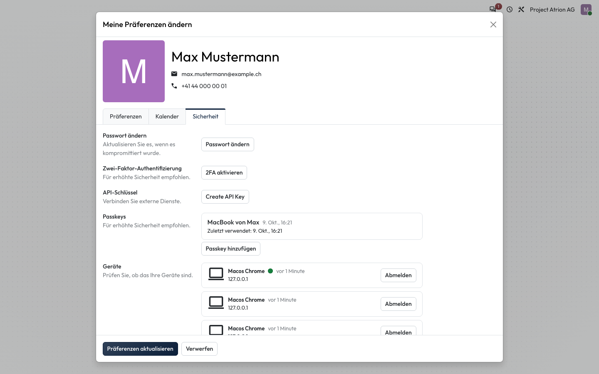

# Passkey einrichten

Einen Passkey anlegen, um dich ohne Passwort mit Fingerabdruck, Gesichtserkennung oder Geräte-PIN anzumelden.

## Wer darf das

Alle angemeldeten Personen.

## Schritte

1. Öffne über dein Profilbild **Meine Präferenzen**, Reiter **Sicherheit**, und klicke bei **Passkeys** auf **Passkey hinzufügen**. Bestätige danach mit deinem Passwort.

    

2. Gib dem Passkey einen Namen, an dem du das Gerät erkennst, zum Beispiel **MacBook von Max**, und klicke auf **Erstellen**. Dein Gerät fragt nach Fingerabdruck, Gesicht oder PIN.

    

3. Der Passkey erscheint unter **Passkeys** mit dem Datum der letzten Verwendung.

    

<!-- video -->

<iframe src="https://player.vimeo.com/video/1234425160?dnt=1&title=0&byline=0&portrait=0" title="Video: Passkey einrichten" allow="fullscreen; picture-in-picture" loading="lazy"></iframe>

<!-- /video -->

## Hinweise

- Ein Passkey gilt für das Gerät bzw. den Passwortmanager, mit dem du ihn erstellt hast. Für weitere Geräte richtest du je einen eigenen Passkey ein.
- Dein Passwort bleibt gültig; der Passkey ist ein zusätzlicher, bequemer Weg.
