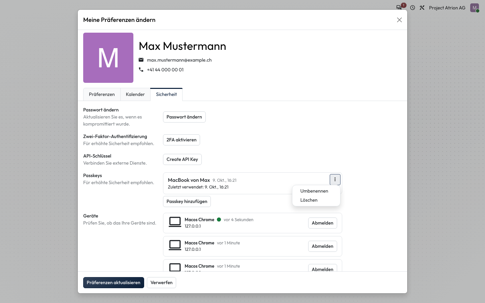
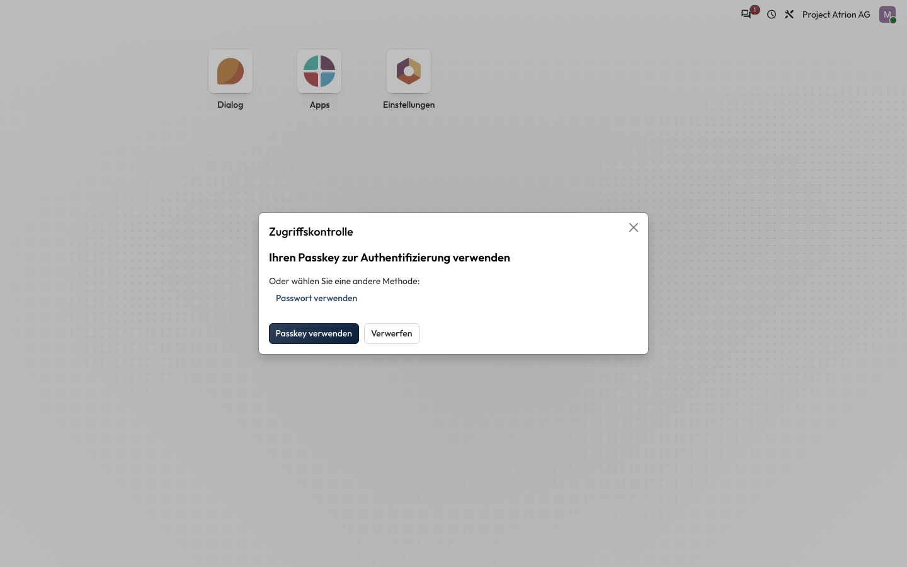
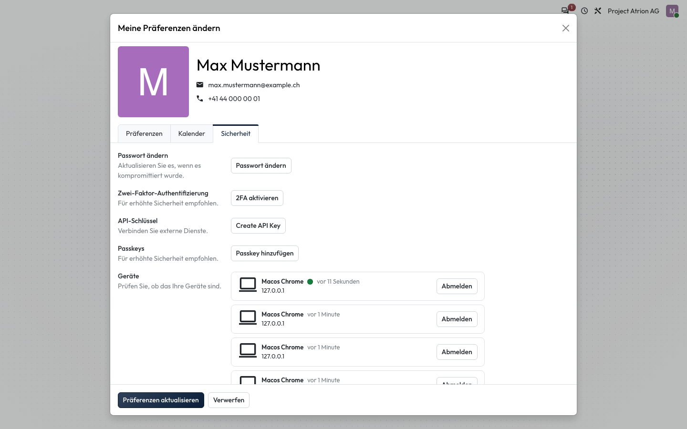

# Passkey entfernen

Einen Passkey löschen, zum Beispiel wenn du ein Gerät nicht mehr verwendest.

## Wer darf das

Alle angemeldeten Personen.

## Schritte

1. Öffne über dein Profilbild **Meine Präferenzen**, Reiter **Sicherheit**. Klicke beim Passkey auf **⋮** und wähle **Löschen**.

    

2. Atrion fragt zur Sicherheit nach deiner Identität. Klicke auf **Passkey verwenden** und bestätige auf deinem Gerät, oder wähle **Passwort verwenden**.

    

3. Der Passkey steht nicht mehr unter **Passkeys**; mit diesem Gerät meldest du dich wieder mit Passwort an.

    

## Hinweise

- Mit **Umbenennen** im selben Menü gibst du dem Passkey einen neuen Namen.
