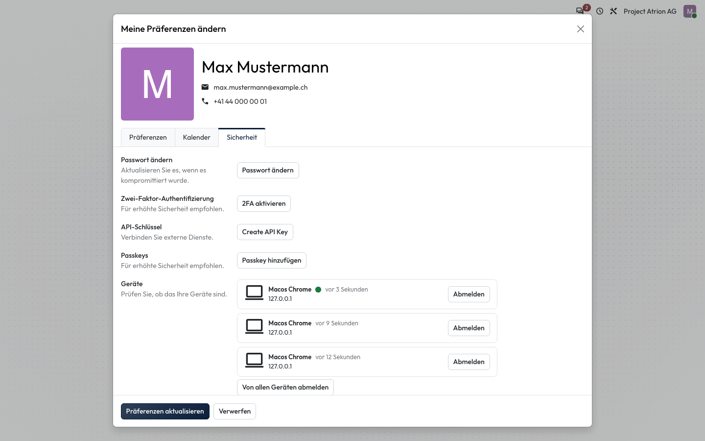
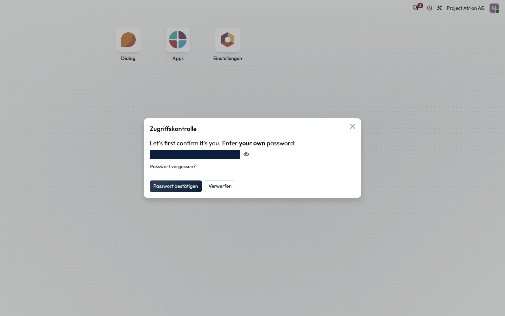
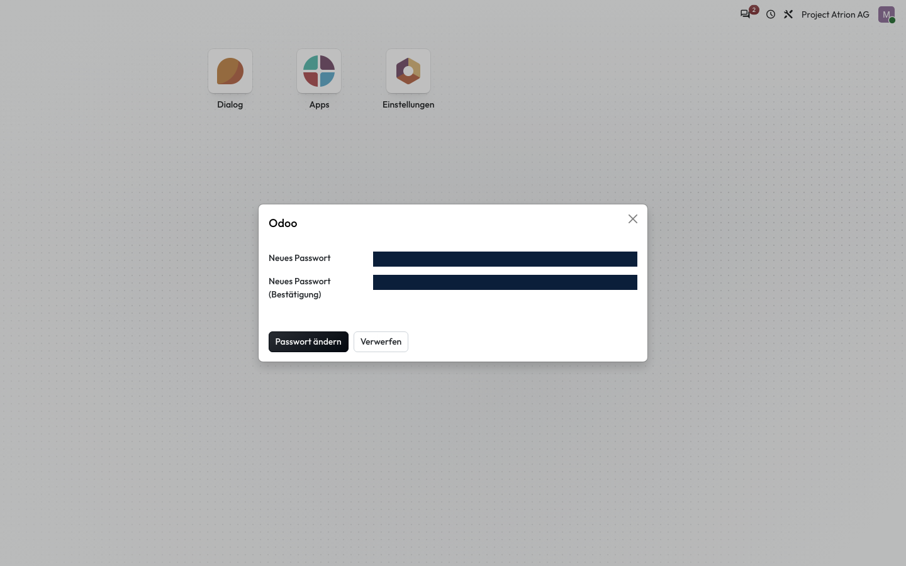

# Passwort ändern

Das eigene Passwort ändern, wenn du angemeldet bist.

## Wer darf das

Alle angemeldeten Personen.

## Schritte

1. Öffne über dein Profilbild **Meine Präferenzen**, wechsle zum Reiter **Sicherheit** und klicke auf **Passwort ändern**.

    

2. Bestätige im Fenster **Zugriffskontrolle** mit deinem aktuellen Passwort und klicke auf **Passwort bestätigen**.

    

3. Gib das neue Passwort zweimal ein und klicke auf **Passwort ändern**.

    

## Hinweise

- Nach dem Ändern bleibst du in diesem Browser angemeldet. Andere Geräte musst du neu anmelden.
- Die Zugriffskontrolle erscheint nur, wenn du dein Passwort nicht vor kurzem schon bestätigt hast.
