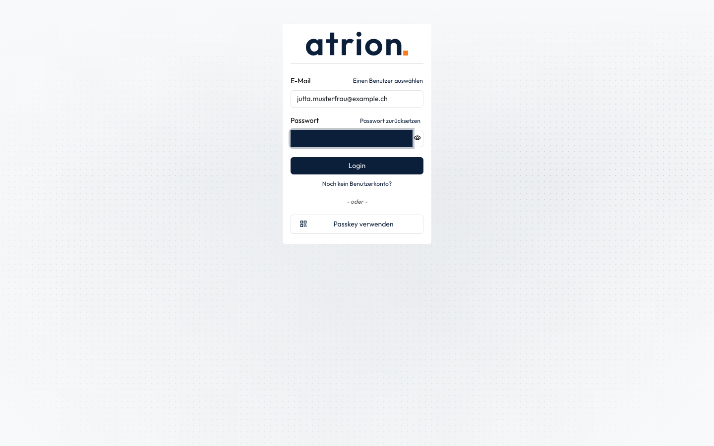
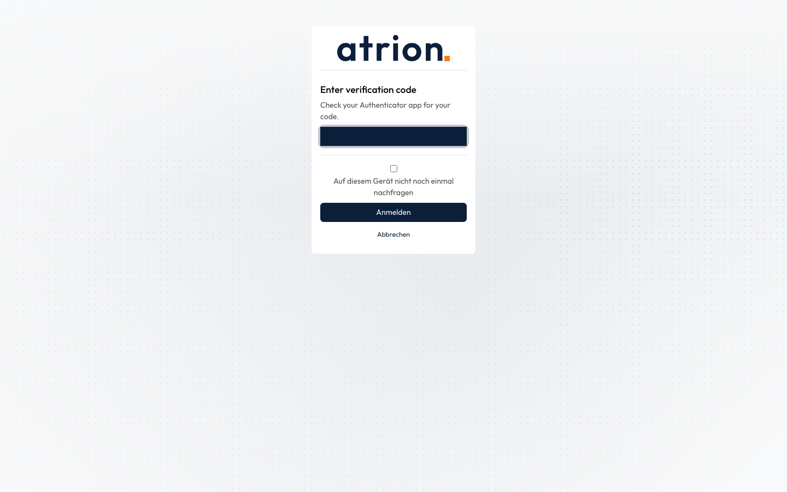

# Mit zweitem Faktor anmelden

Anmelden, wenn die Zwei-Faktor-Anmeldung eingeschaltet ist.

## Wer darf das

Alle Personen mit eingeschalteter Zwei-Faktor-Anmeldung.

## Schritte

1. Gib auf der Anmeldeseite wie gewohnt **E-Mail** und **Passwort** ein und klicke auf **Login**.

    

2. Auf der nächsten Seite gibst du den sechsstelligen Code aus deiner Authenticator-App ein und klickst auf **Anmelden**.

    

3. Du bist angemeldet und siehst die Startseite.

    

## Hinweise

- Der Code wechselt alle 30 Sekunden. Läuft er gerade ab, warte auf den nächsten.
- Mit dem Häkchen **Auf diesem Gerät nicht noch einmal nachfragen** fragt Atrion auf diesem Gerät eine Zeit lang nicht mehr nach dem Code.
- Handy verloren? Die Administration kann die Zwei-Faktor-Anmeldung für dich ausschalten.
