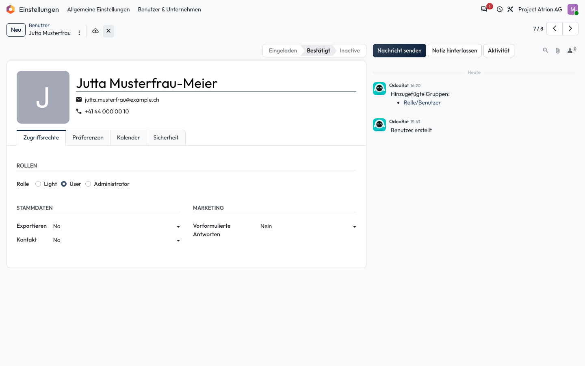
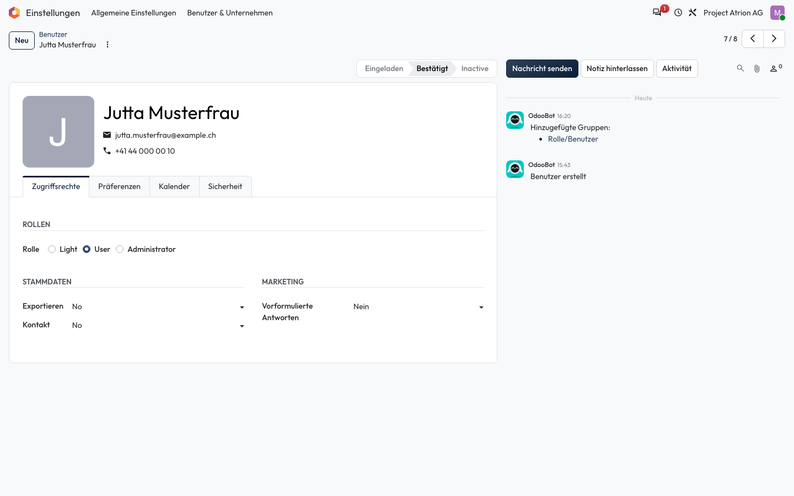

# Änderungen verwerfen

Noch nicht gespeicherte Änderungen zurücknehmen.

## Wer darf das

Alle Personen, die den Datensatz bearbeiten dürfen. Das Beispiel zeigt das Formular einer Person unter **Einstellungen › Benutzer & Unternehmen › Benutzer**.

## Schritte

1. Sobald du ein Feld änderst, erscheinen neben dem Titel das Wolken-Symbol (speichern) und das **×** (verwerfen).

    

2. Klicke auf **×**. Das Formular zeigt wieder den gespeicherten Stand.

    

## Hinweise

- Bereits gespeicherte Änderungen lassen sich so nicht zurücknehmen.
