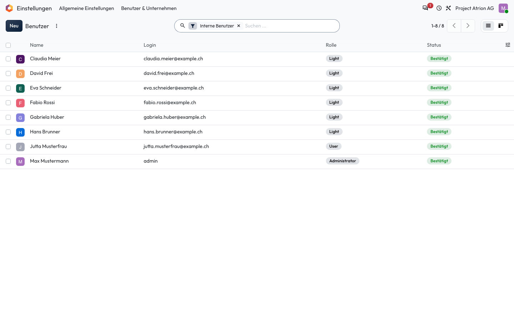
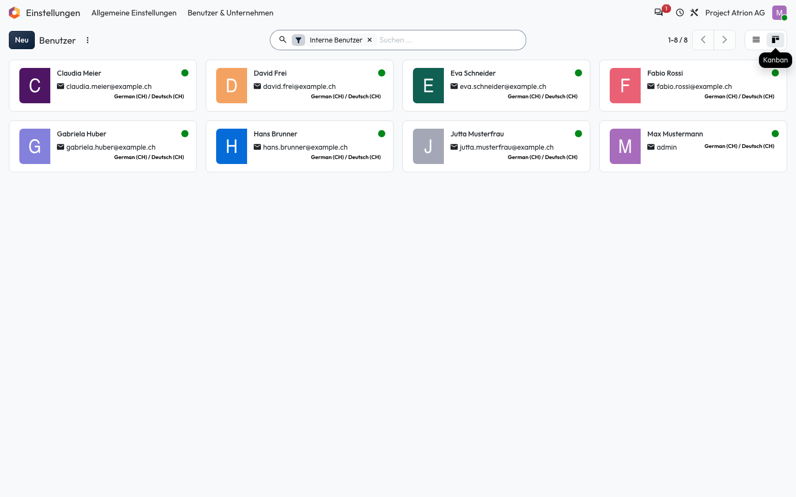

# Ansichten wechseln

Dieselben Daten als Liste oder als Karten anzeigen.

## Wer darf das

Alle Personen, die die Liste sehen dürfen. Das Beispiel zeigt die Benutzerliste unter **Einstellungen › Benutzer & Unternehmen › Benutzer**; sie ist nur für die Administration sichtbar. In jeder anderen Liste funktioniert es gleich.

## Schritte

1. Oben rechts neben dem Seitenwechsler stehen die verfügbaren Ansichten. In der **Liste** siehst du die Daten als Tabelle.

    

2. Klicke auf **Kanban**, um dieselben Datensätze als Karten zu sehen.

    

## Hinweise

- Welche Ansichten es gibt, hängt von der Liste ab.
