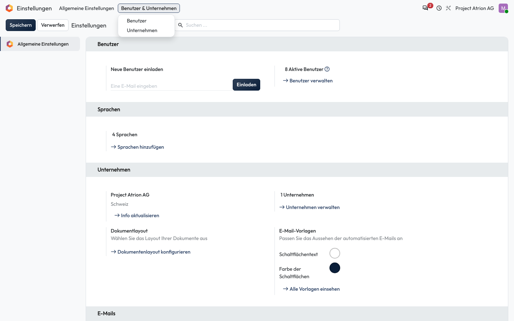
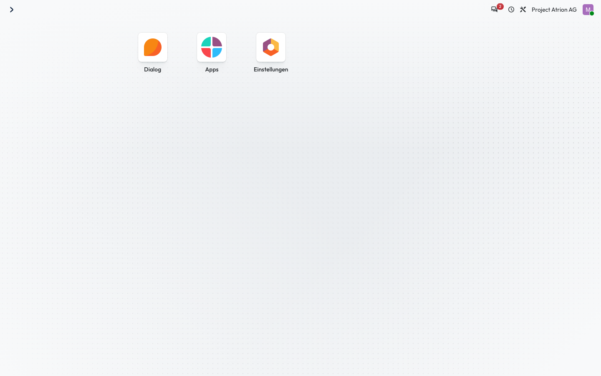

# Apps und Menüs

Zwischen den Apps wechseln und ihre Menüs nutzen.

## Wer darf das

Alle angemeldeten Personen.

## Schritte

1. Nach der Anmeldung zeigt die Startseite alle Apps, die du nutzen darfst. Klicke auf eine App, um sie zu öffnen.

    

2. In der App stehen die Menüs oben in der Leiste. Ein Menü mit Untermenüs klappt beim Klicken auf.

    

3. Mit dem Symbol oben links kommst du jederzeit zur Startseite zurück.

    

## Hinweise

- Welche Apps du siehst, hängt von deinen Zugriffsrechten ab.
