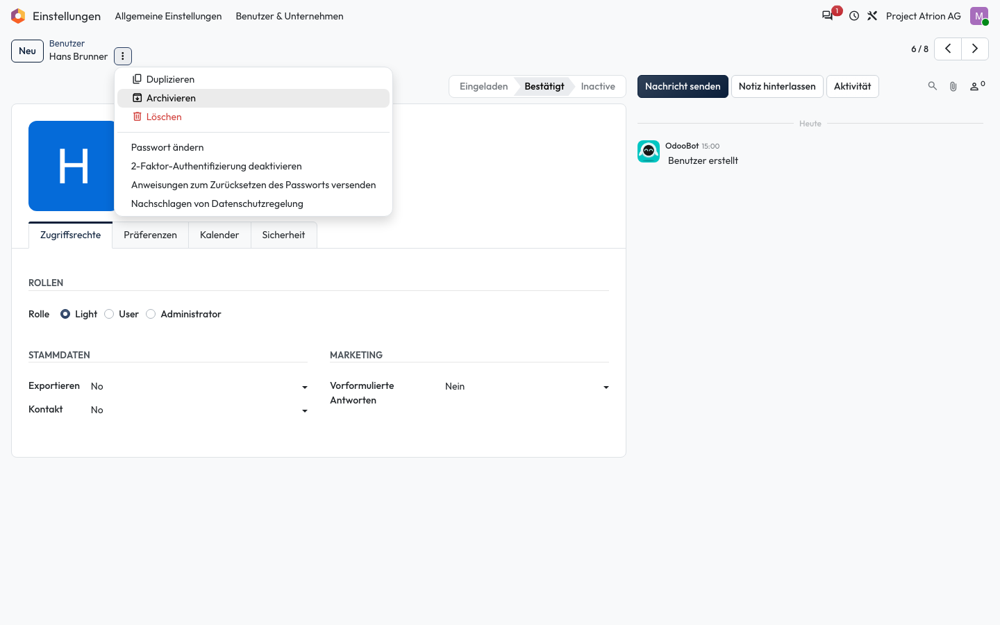
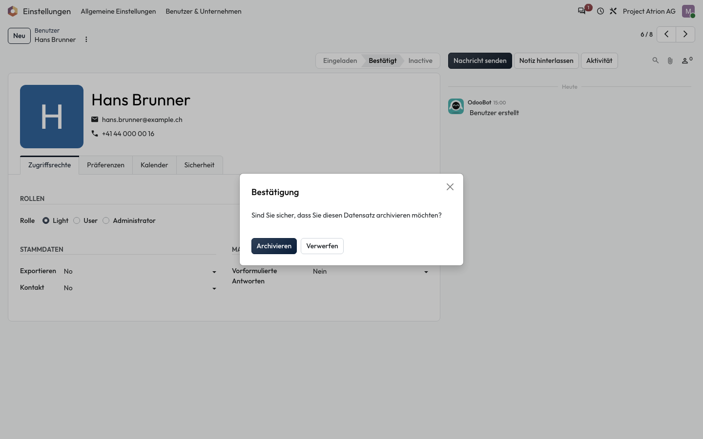

# Archivieren, wiederherstellen und löschen

Nicht mehr benötigte Einträge ausblenden oder endgültig entfernen.

## Wer darf das

Alle Personen, die den Datensatz bearbeiten dürfen. Das Beispiel zeigt das Formular einer Person unter **Einstellungen › Benutzer & Unternehmen › Benutzer**.

## Schritte

1. Klicke neben dem Titel auf **⋮**. Dort stehen **Archivieren** und **Löschen**.

    

2. Bestätige **Archivieren** im Fenster **Bestätigung**. Der Eintrag verschwindet aus der Liste, bleibt aber erhalten.

    

## Hinweise

- Archivierte Einträge findest du über den Filter **Inaktive …** und holst sie mit **Archivierung aufheben** zurück.
- **Löschen** entfernt den Eintrag endgültig. Wo möglich, archiviere statt zu löschen.
