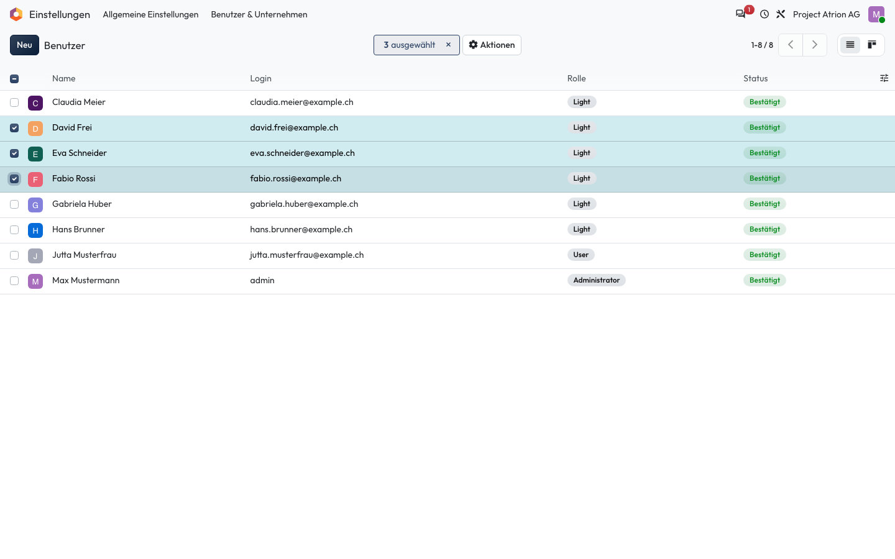
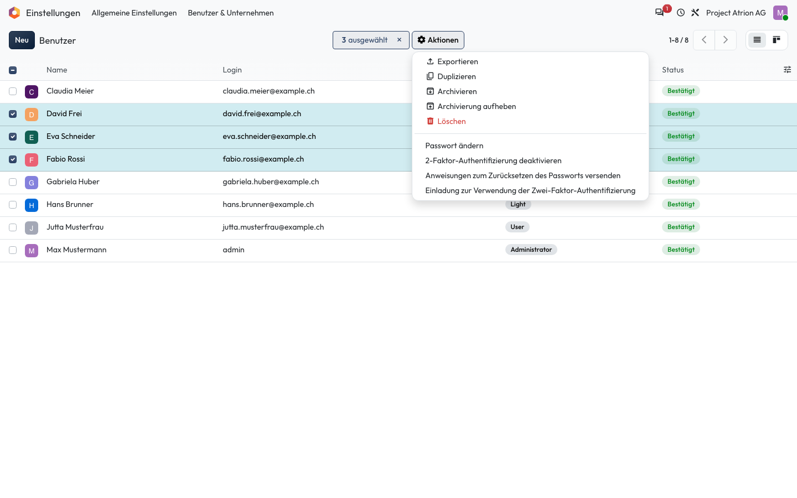

# Mehrere Datensätze auswählen und bearbeiten

Mehrere Einträge auf einmal markieren und gemeinsam bearbeiten.

## Wer darf das

Alle Personen, die die Liste sehen dürfen. Das Beispiel zeigt die Benutzerliste unter **Einstellungen › Benutzer & Unternehmen › Benutzer**; sie ist nur für die Administration sichtbar. In jeder anderen Liste funktioniert es gleich.

## Schritte

1. Hake links die gewünschten Zeilen an. Oben erscheint die Anzahl ausgewählter Einträge.

    

2. Unter **Aktionen** stehen die Befehle für alle markierten Einträge, zum Beispiel **Exportieren**, **Archivieren** oder **Löschen**.

    

## Hinweise

- Mit dem Kästchen in der Kopfzeile markierst du alle Einträge der Seite.
- Wenn du in einer markierten Zeile ein Feld änderst, fragt Atrion, ob die Änderung für alle markierten Einträge gelten soll.
