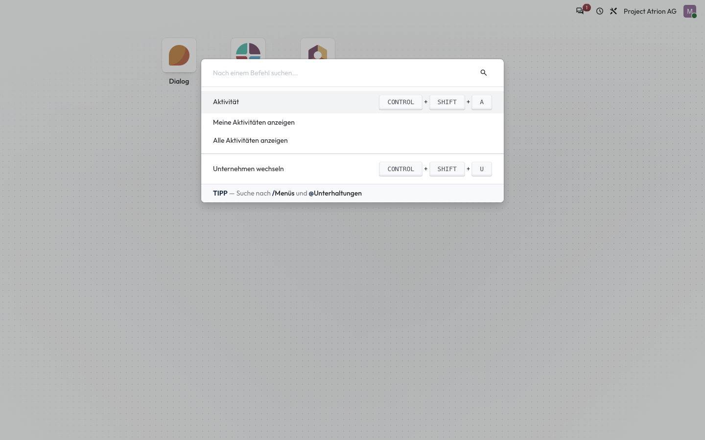
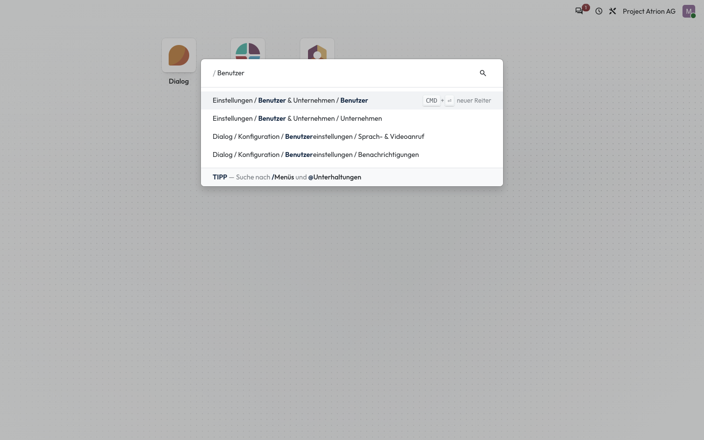

# Befehlspalette

Menüs, Befehle und Unterhaltungen über die Tastatur finden.

## Wer darf das

Alle angemeldeten Personen.

## Schritte

1. Drücke **Ctrl + K** (Mac: **Cmd + K**). Die Befehlspalette öffnet sich mit den häufigsten Befehlen.

    

2. Tippe **/** und einen Begriff, um Menüs zu suchen, zum Beispiel **/Benutzer**. Mit **Enter** öffnest du den markierten Eintrag.

    

## Hinweise

- Mit **@** suchst du Personen und Unterhaltungen.
- Die Befehlspalette erreichst du auch über dein Profilbild › **Shortcuts**.
