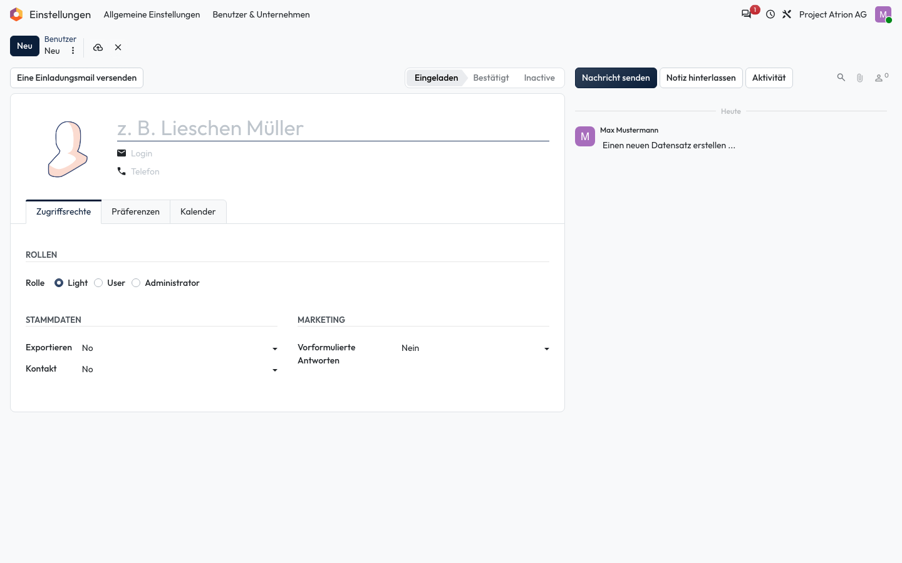
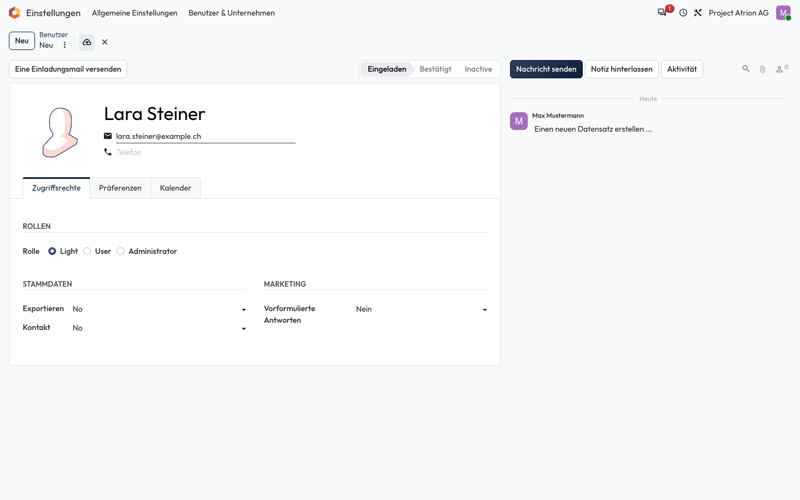

# Datensatz anlegen und bearbeiten

Einen neuen Eintrag erfassen oder einen bestehenden ändern.

## Wer darf das

Alle Personen, die den Datensatz bearbeiten dürfen. Das Beispiel zeigt das Formular einer Person unter **Einstellungen › Benutzer & Unternehmen › Benutzer**.

## Schritte

1. Klicke in der Liste oben links auf **Neu**. Es öffnet sich ein leeres Formular.

    

2. Fülle die Felder aus. Atrion speichert automatisch, wenn du das Formular verlässt; mit dem Wolken-Symbol neben dem Titel speicherst du sofort.

    

## Hinweise

- Fehlt ein Pflichtfeld, markiert Atrion es rot und speichert nicht.
- Bestehende Einträge öffnest du mit einem Klick in der Liste und bearbeitest sie direkt.
