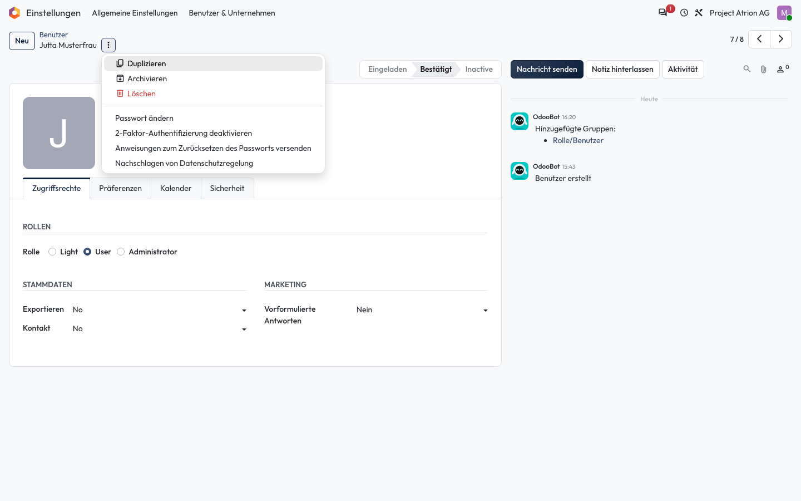

# Datensatz duplizieren

Eine Kopie eines Eintrags als Vorlage für einen neuen anlegen.

## Wer darf das

Alle Personen, die den Datensatz bearbeiten dürfen. Das Beispiel zeigt das Formular einer Person unter **Einstellungen › Benutzer & Unternehmen › Benutzer**.

## Schritte

1. Öffne den Eintrag, klicke neben dem Titel auf **⋮** und wähle **Duplizieren**. Atrion öffnet die Kopie, die du anpassen und speichern kannst.

    

## Hinweise

- Felder, die eindeutig sein müssen (zum Beispiel ein Login), übernimmt Atrion nicht unverändert.
