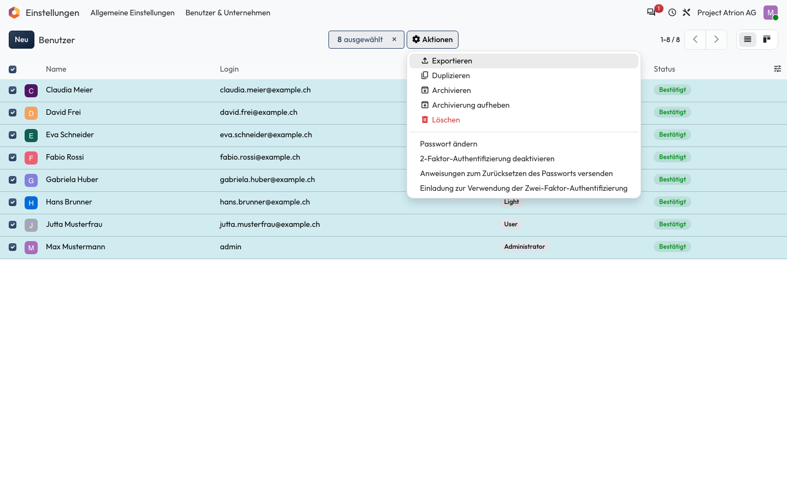
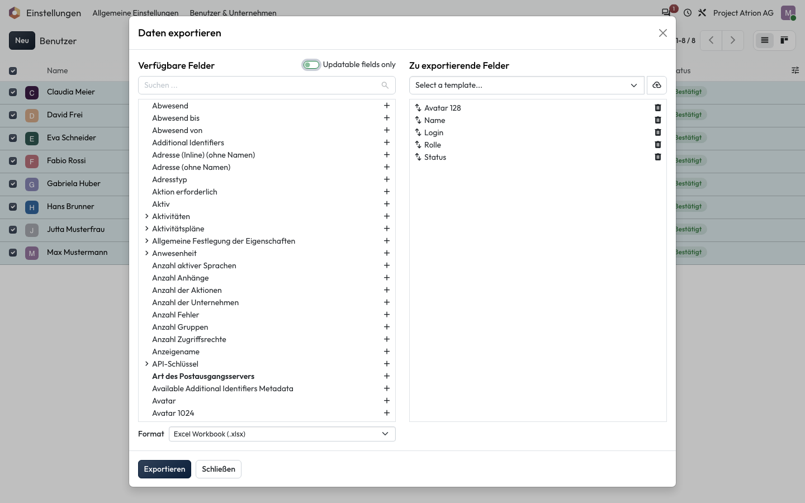

# Exportieren

Daten aus einer Liste als Excel- oder CSV-Datei herunterladen.

## Wer darf das

Alle Personen, die die Liste sehen dürfen. Das Beispiel zeigt die Benutzerliste unter **Einstellungen › Benutzer & Unternehmen › Benutzer**; sie ist nur für die Administration sichtbar. In jeder anderen Liste funktioniert es gleich.

## Schritte

1. Markiere die gewünschten Zeilen (oder alle über das Kästchen in der Kopfzeile) und wähle unter **Aktionen** **Exportieren**.

    

2. Stelle links die Felder zusammen, wähle das **Format** und klicke auf **Exportieren**.

    

## Hinweise

- Eine Feldauswahl speicherst du als Vorlage über **Select a template**.
- **Updatable fields only** zeigt nur Felder, die du später wieder importieren kannst.
