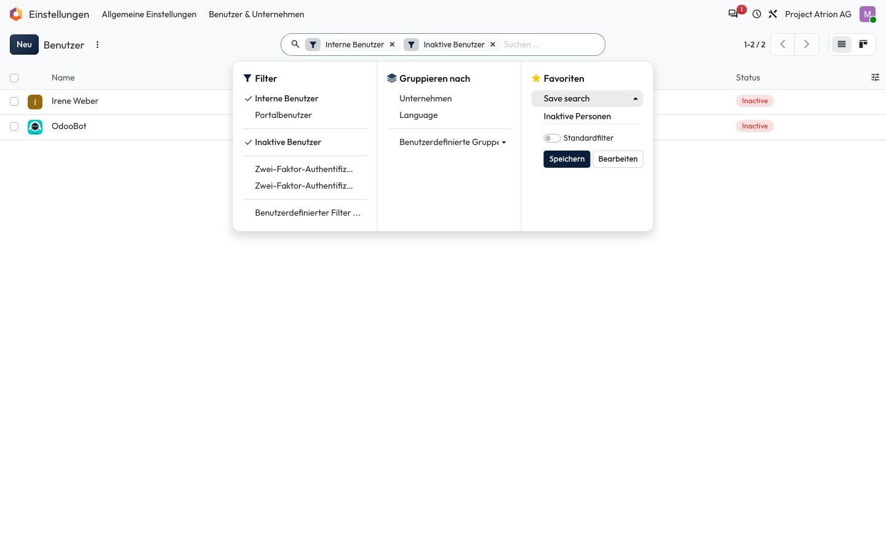

# Favoriten speichern

Eine Suche mit Filtern speichern, um sie später mit einem Klick wieder zu öffnen.

## Wer darf das

Alle Personen, die die Liste sehen dürfen. Das Beispiel zeigt die Benutzerliste unter **Einstellungen › Benutzer & Unternehmen › Benutzer**; sie ist nur für die Administration sichtbar. In jeder anderen Liste funktioniert es gleich.

## Schritte

1. Stelle Suche, Filter und Gruppierung ein. Öffne mit dem Pfeil im Suchfeld das Suchmenü, klicke unter **Favoriten** auf **Save search**, gib einen Namen ein und klicke auf **Speichern**.

    

## Hinweise

- Mit **Standardfilter** öffnet sich die Liste künftig direkt mit diesem Favoriten.
- Gespeicherte Favoriten stehen danach unter **Favoriten** im Suchmenü.
