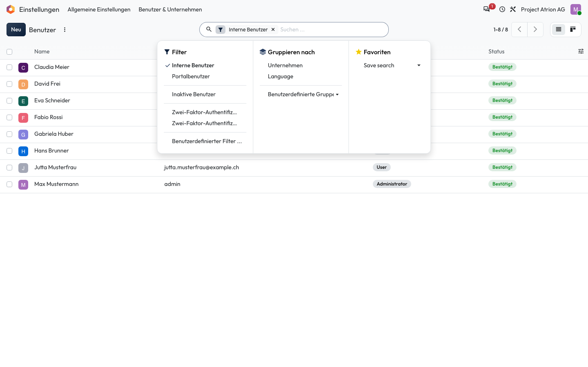
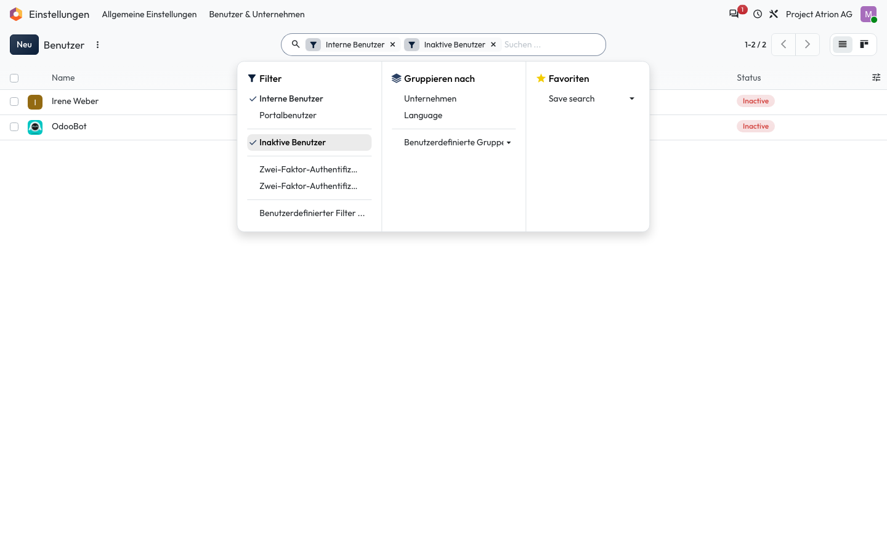

# Filtern

Eine Liste auf bestimmte Datensätze einschränken.

## Wer darf das

Alle Personen, die die Liste sehen dürfen. Das Beispiel zeigt die Benutzerliste unter **Einstellungen › Benutzer & Unternehmen › Benutzer**; sie ist nur für die Administration sichtbar. In jeder anderen Liste funktioniert es gleich.

## Schritte

1. Klicke im Suchfeld rechts auf den Pfeil. Unter **Filter** stehen die vorbereiteten Filter.

    

2. Klicke auf einen Filter, zum Beispiel **Inaktive Benutzer**. Die Liste zeigt nur noch passende Einträge.

    

## Hinweise

- Mit **Benutzerdefinierter Filter …** baust du eigene Bedingungen.
- Aktive Filter erscheinen als Kästchen im Suchfeld.
