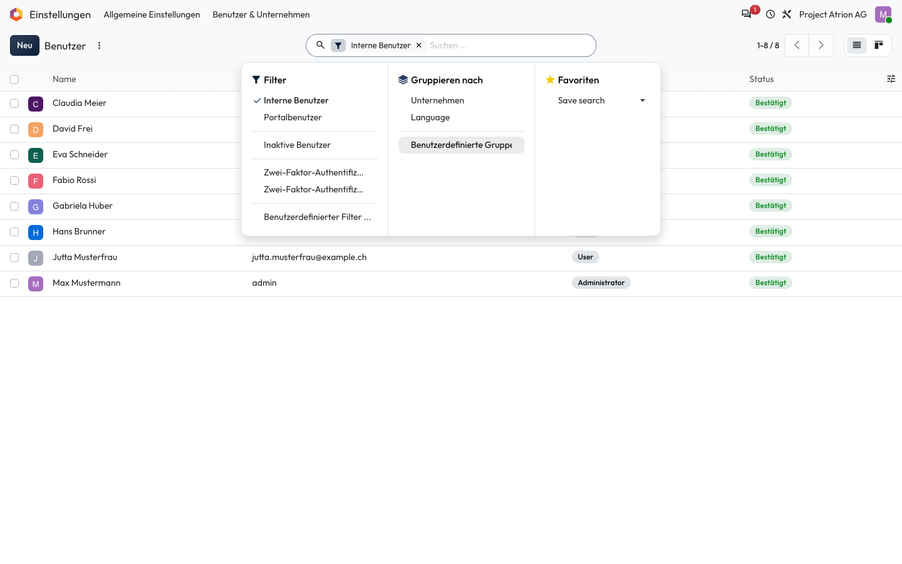
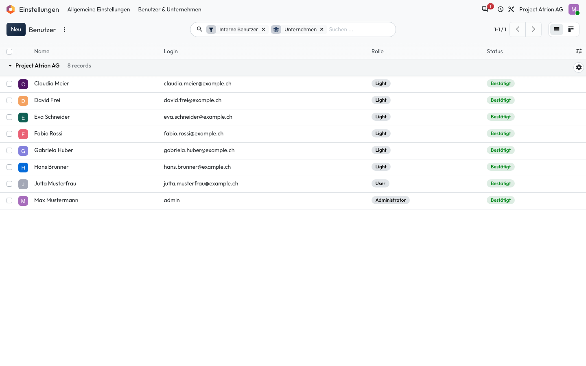

# Gruppieren

Eine Liste nach einem Feld in Gruppen gliedern.

## Wer darf das

Alle Personen, die die Liste sehen dürfen. Das Beispiel zeigt die Benutzerliste unter **Einstellungen › Benutzer & Unternehmen › Benutzer**; sie ist nur für die Administration sichtbar. In jeder anderen Liste funktioniert es gleich.

## Schritte

1. Öffne mit dem Pfeil im Suchfeld das Suchmenü. Unter **Gruppieren nach** stehen die möglichen Felder.

    

2. Wähle ein Feld, zum Beispiel **Unternehmen**. Die Liste zeigt Gruppen mit der Anzahl Einträge; ein Klick auf die Gruppe klappt sie auf und zu.

    

## Hinweise

- Mit **Benutzerdefinierte Gruppe** gruppierst du nach jedem anderen Feld.
- Mehrere Gruppierungen werden verschachtelt.
