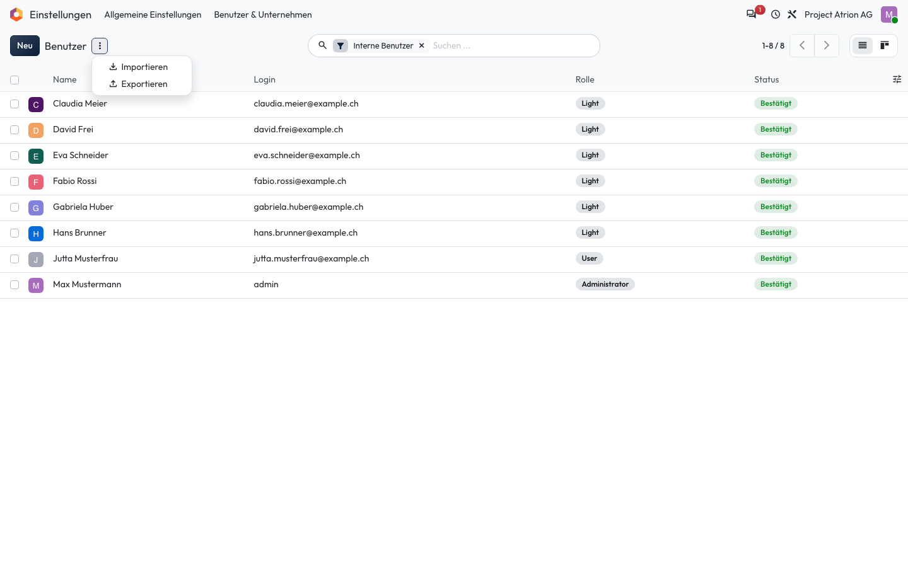
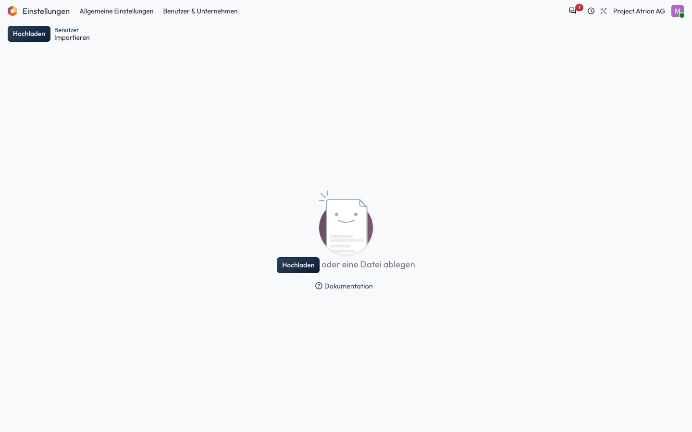

# Importieren

Daten aus einer Excel- oder CSV-Datei in eine Liste übernehmen.

## Wer darf das

Alle Personen, die die Liste sehen dürfen. Das Beispiel zeigt die Benutzerliste unter **Einstellungen › Benutzer & Unternehmen › Benutzer**; sie ist nur für die Administration sichtbar. In jeder anderen Liste funktioniert es gleich.

## Schritte

1. Klicke neben dem Listentitel auf **⋮** und wähle **Importieren**.

    

2. Klicke auf **Hochladen** oder ziehe die Datei in das Fenster. Atrion ordnet die Spalten zu; prüfe die Zuordnung und starte den Import.

    

## Hinweise

- Am einfachsten exportierst du zuerst ein paar Einträge und verwendest die Datei als Vorlage.
- **Testen** prüft die Datei, ohne etwas zu speichern.
