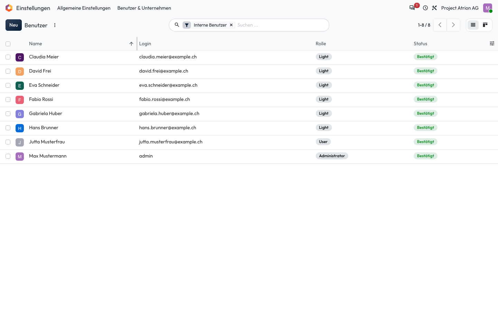
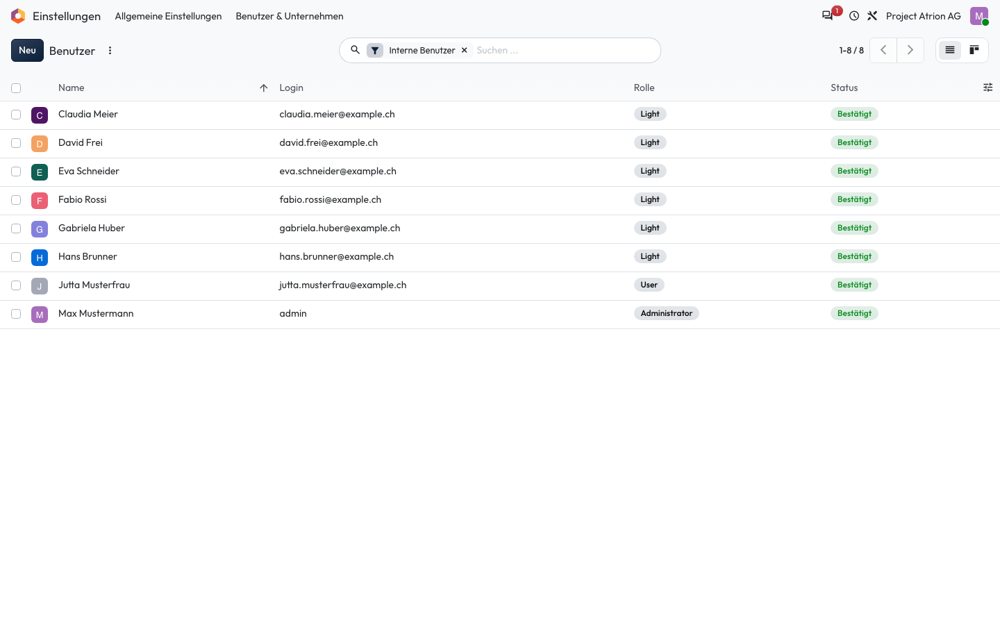

# Sortieren und blättern

Eine Liste sortieren und durch längere Listen blättern.

## Wer darf das

Alle Personen, die die Liste sehen dürfen. Das Beispiel zeigt die Benutzerliste unter **Einstellungen › Benutzer & Unternehmen › Benutzer**; sie ist nur für die Administration sichtbar. In jeder anderen Liste funktioniert es gleich.

## Schritte

1. Klicke auf eine Spaltenüberschrift, um nach dieser Spalte zu sortieren. Ein zweiter Klick kehrt die Reihenfolge um.

    

2. Oben rechts zeigt der Seitenwechsler, welche Einträge du siehst (zum Beispiel **1-8 / 8**). Mit den Pfeilen blätterst du weiter.

    

## Hinweise

- Ein Klick auf die Zahlen im Seitenwechsler lässt dich den angezeigten Bereich direkt eingeben, zum Beispiel **1-200**.
