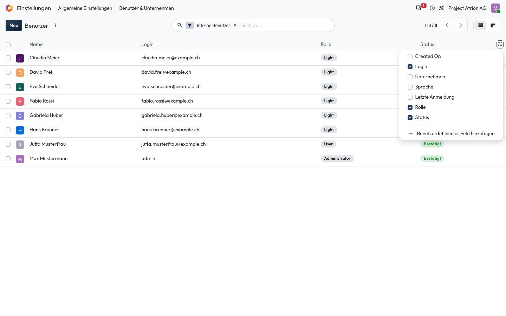

# Spalten ein- und ausblenden

Zusätzliche Spalten in einer Liste anzeigen oder ausblenden.

## Wer darf das

Alle Personen, die die Liste sehen dürfen. Das Beispiel zeigt die Benutzerliste unter **Einstellungen › Benutzer & Unternehmen › Benutzer**; sie ist nur für die Administration sichtbar. In jeder anderen Liste funktioniert es gleich.

## Schritte

1. Klicke rechts in der Kopfzeile der Liste auf das Regler-Symbol und hake die gewünschten Spalten an oder ab.

    

## Hinweise

- Die Auswahl merkt sich Atrion in deinem Browser.
