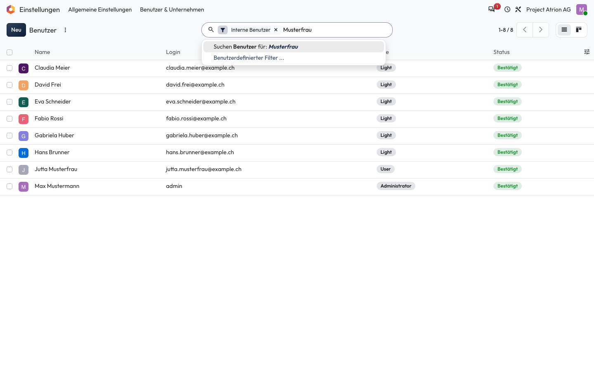
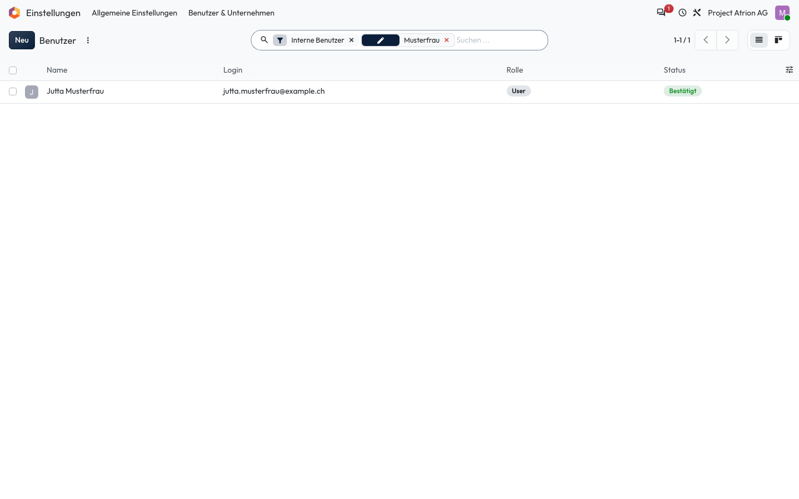

# Suchen

Datensätze in einer Liste schnell finden.

## Wer darf das

Alle Personen, die die Liste sehen dürfen. Das Beispiel zeigt die Benutzerliste unter **Einstellungen › Benutzer & Unternehmen › Benutzer**; sie ist nur für die Administration sichtbar. In jeder anderen Liste funktioniert es gleich.

## Schritte

1. Klicke in das Suchfeld und tippe den Begriff ein. Atrion schlägt vor, in welchem Feld gesucht wird.

    

2. Drücke **Enter**. Die Liste zeigt nur noch die Treffer, der Suchbegriff steht als Kästchen im Suchfeld.

    

## Hinweise

- Mit dem **×** im Kästchen hebst du die Suche wieder auf.
- Mehrere Begriffe im selben Feld werden mit **oder** verknüpft, Begriffe in verschiedenen Feldern mit **und**.
