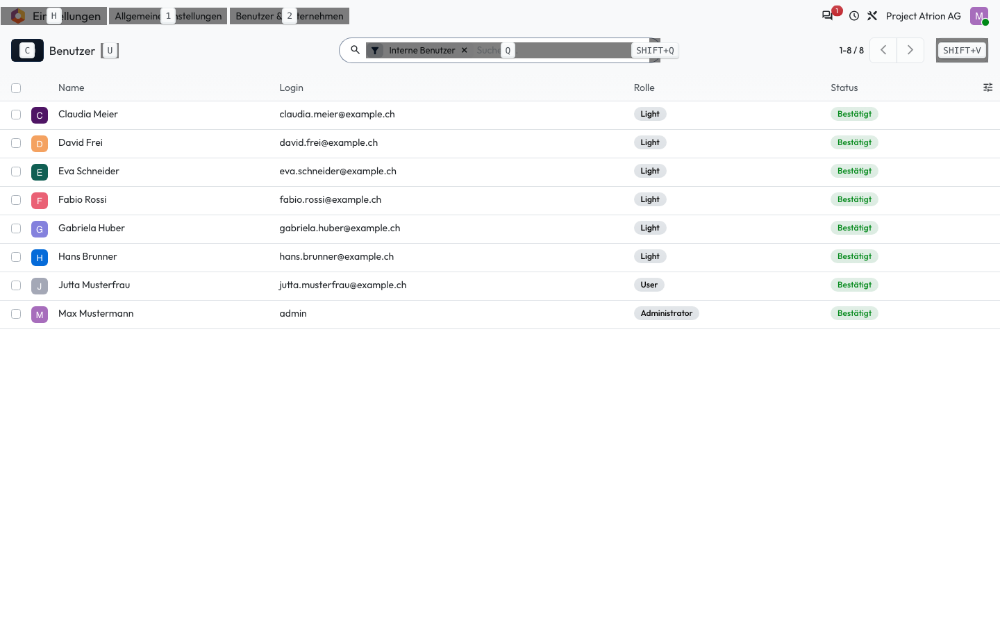

# Tastaturkürzel

Knöpfe und Menüs ohne Maus bedienen.

## Wer darf das

Alle angemeldeten Personen.

## Schritte

1. Halte auf einer beliebigen Seite **Alt** gedrückt (Mac: **Ctrl**). Atrion blendet zu jedem Knopf und Menü den Buchstaben ein. Drücke zusätzlich den Buchstaben, um ihn auszulösen.

    

## Hinweise

- Häufige Kürzel: **Ctrl + K** (Mac: **Cmd + K**) Befehlspalette, **Alt + C** Neu, **Alt + S** Speichern, **Alt + J** Verwerfen. Auf dem Mac jeweils **Ctrl** statt **Alt**.
