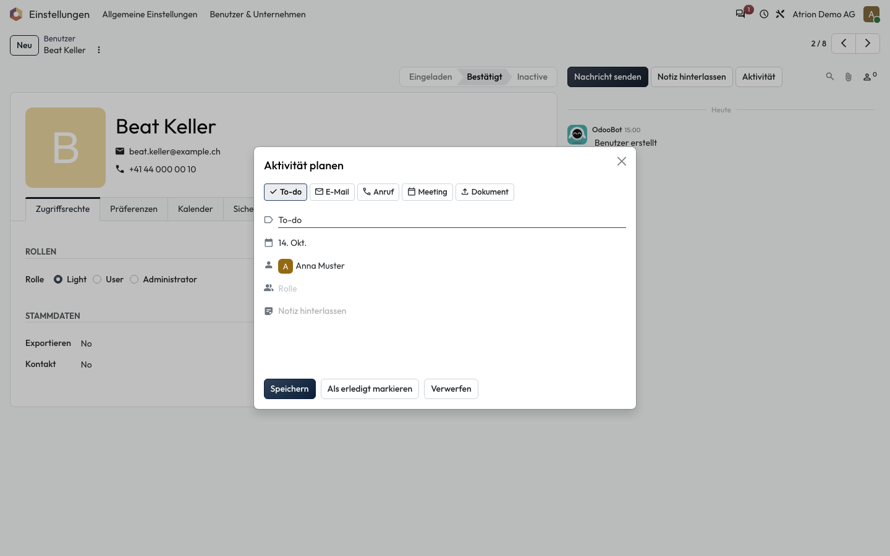
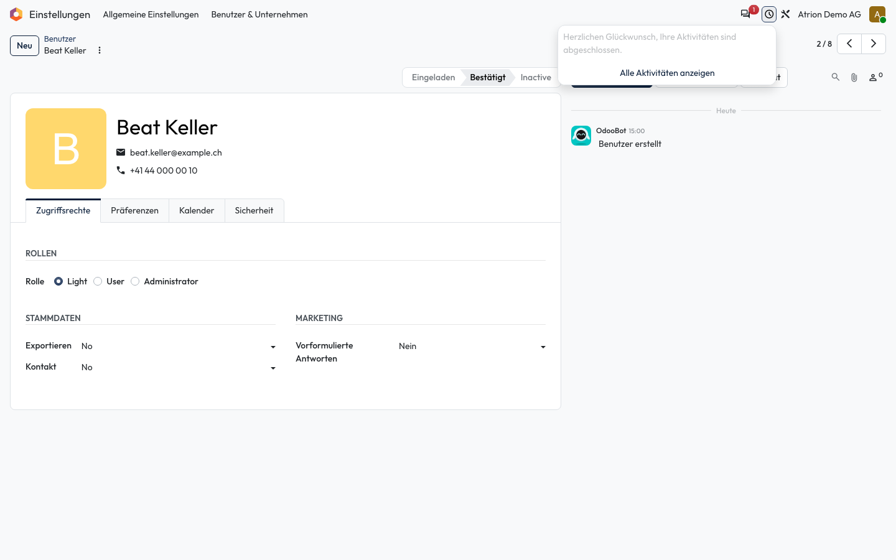

# Aktivitäten planen

Eine Aufgabe mit Fälligkeit zu einem Eintrag planen.

## Wer darf das

Alle Personen, die den Datensatz bearbeiten dürfen. Das Beispiel zeigt das Formular einer Person unter **Einstellungen › Benutzer & Unternehmen › Benutzer**.

## Schritte

1. Klicke rechts im Formular auf **Aktivität**. Wähle die Art (zum Beispiel **To-do** oder **Anruf**), das Fälligkeitsdatum und die zuständige Person und klicke auf **Speichern**.

    

2. Alle deine Aktivitäten siehst du oben rechts beim Uhr-Symbol. Mit **Alle Aktivitäten anzeigen** öffnest du die Übersicht.

    

## Hinweise

- **Als erledigt markieren** schliesst die Aktivität sofort ab.
