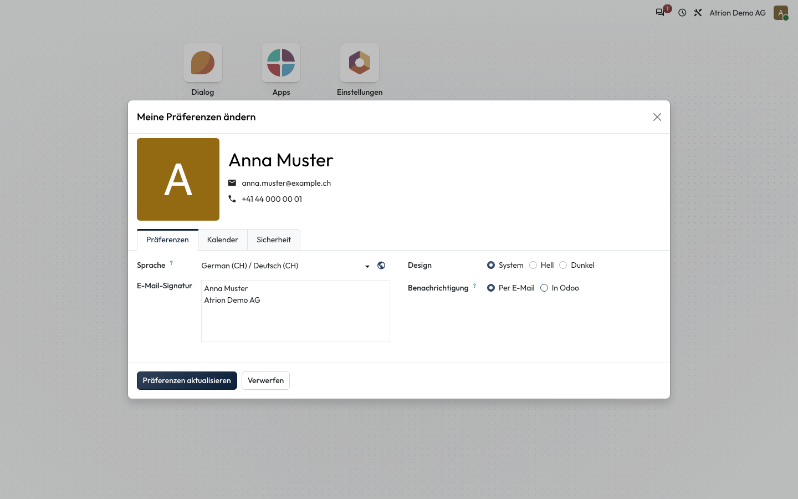

# Benachrichtigungen per E-Mail oder in Atrion

Festlegen, ob du Nachrichten per E-Mail oder nur in Atrion erhältst.

## Wer darf das

Alle angemeldeten Personen.

## Schritte

1. Öffne über dein Profilbild **Meine Präferenzen** und wähle unter **Benachrichtigung** entweder **Per E-Mail** oder **In Odoo**. Speichere mit **Präferenzen aktualisieren**.

    

## Hinweise

- **In Odoo** heisst: Nachrichten erscheinen nur im Posteingang von Atrion, siehe [Posteingang und Erwähnungen](posteingang.md).
