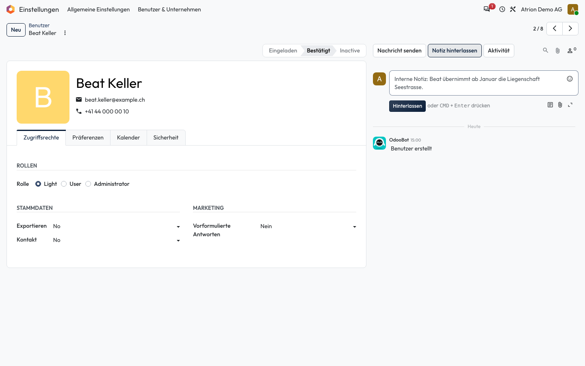

# Nachrichten und Notizen

Zu einem Eintrag Nachrichten schreiben oder interne Notizen festhalten.

## Wer darf das

Alle Personen, die den Datensatz bearbeiten dürfen. Das Beispiel zeigt das Formular einer Person unter **Einstellungen › Benutzer & Unternehmen › Benutzer**.

## Schritte

1. Klicke rechts im Formular auf **Nachricht senden**, schreibe den Text und klicke auf **Senden**. Die Nachricht geht an alle Follower des Eintrags.

    

2. Für eine interne Notiz klicke auf **Notiz hinterlassen**. Notizen sehen nur interne Personen, es geht keine E-Mail hinaus.

    

## Hinweise

- Mit **@Name** erwähnst du eine Person; sie erhält eine Benachrichtigung.
- Der Verlauf unter dem Eingabefeld zeigt alle Nachrichten, Notizen und Änderungen.
