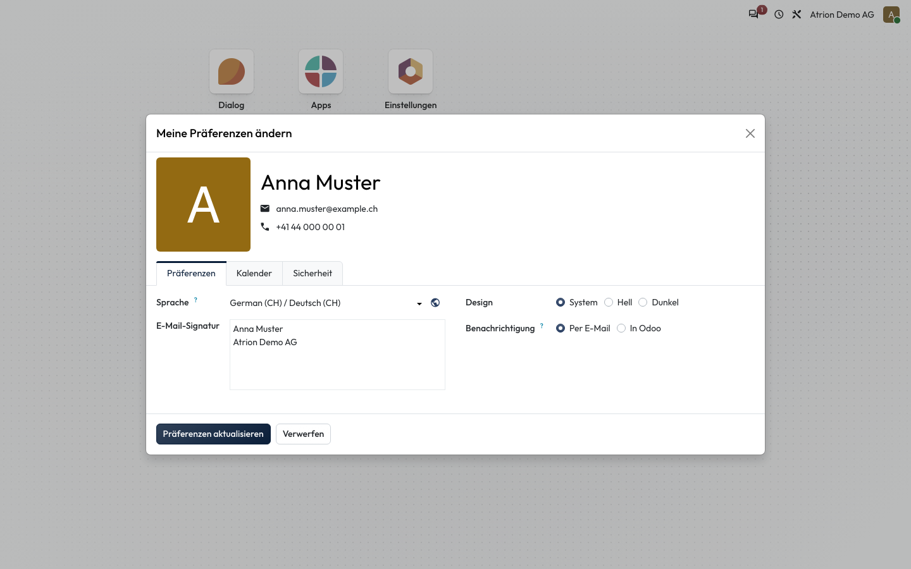

# Darstellung hell oder dunkel

Die Oberfläche hell, dunkel oder passend zum Betriebssystem anzeigen.

## Wer darf das

Alle angemeldeten Personen.

## Schritte

1. Öffne über dein Profilbild **Meine Präferenzen** und wähle unter **Design** **System**, **Hell** oder **Dunkel**. Speichere mit **Präferenzen aktualisieren**.

    

## Hinweise

- **System** folgt der Einstellung deines Computers oder Smartphones.
