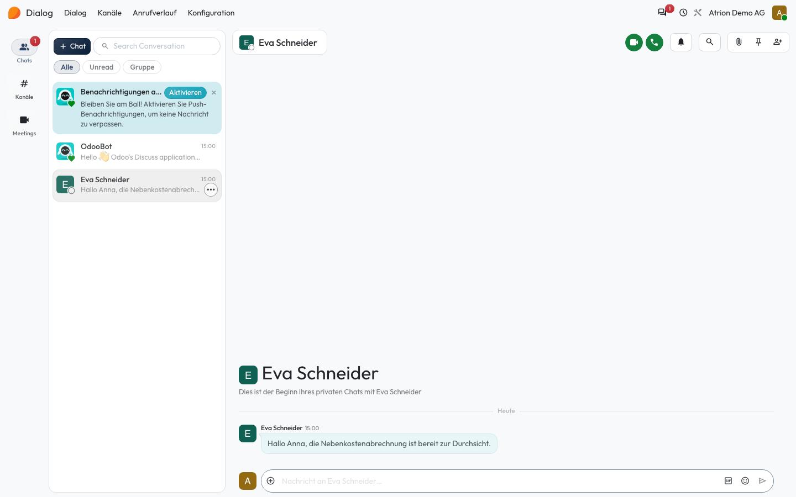
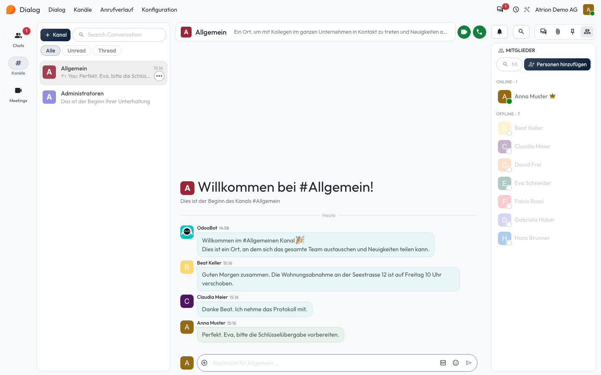

# Direktnachrichten und Kanäle

Mit Kolleginnen und Kollegen chatten, einzeln oder im Kanal.

## Wer darf das

Alle angemeldeten Personen.

## Schritte

1. Öffne auf der Startseite die App **Dialog**. Unter **Chats** stehen deine Direktnachrichten; ein Klick öffnet die Unterhaltung, unten schreibst du die Antwort.

    

2. Unter **Kanäle** stehen die Kanäle, in denen du Mitglied bist, zum Beispiel **Allgemein** für das ganze Team. Rechts siehst du die Mitglieder.

    

## Hinweise

- Mit **+ Chat** bzw. **+ Kanal** startest du eine neue Unterhaltung.
- Über die Symbole oben rechts startest du einen Anruf oder eine Videokonferenz.
