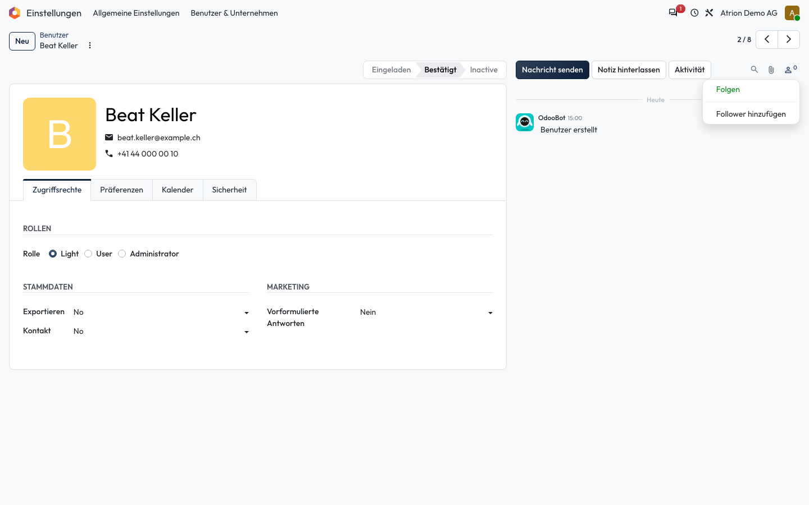

# Datensätzen folgen

Bei Änderungen und Nachrichten zu einem Eintrag benachrichtigt werden.

## Wer darf das

Alle Personen, die den Datensatz bearbeiten dürfen. Das Beispiel zeigt das Formular einer Person unter **Einstellungen › Benutzer & Unternehmen › Benutzer**.

## Schritte

1. Klicke rechts oben im Formular auf das Personen-Symbol. Mit **Folgen** folgst du dem Eintrag, mit **Follower hinzufügen** lädst du weitere Personen ein.

    

## Hinweise

- Die Zahl neben dem Symbol zeigt, wie viele Personen dem Eintrag folgen.
