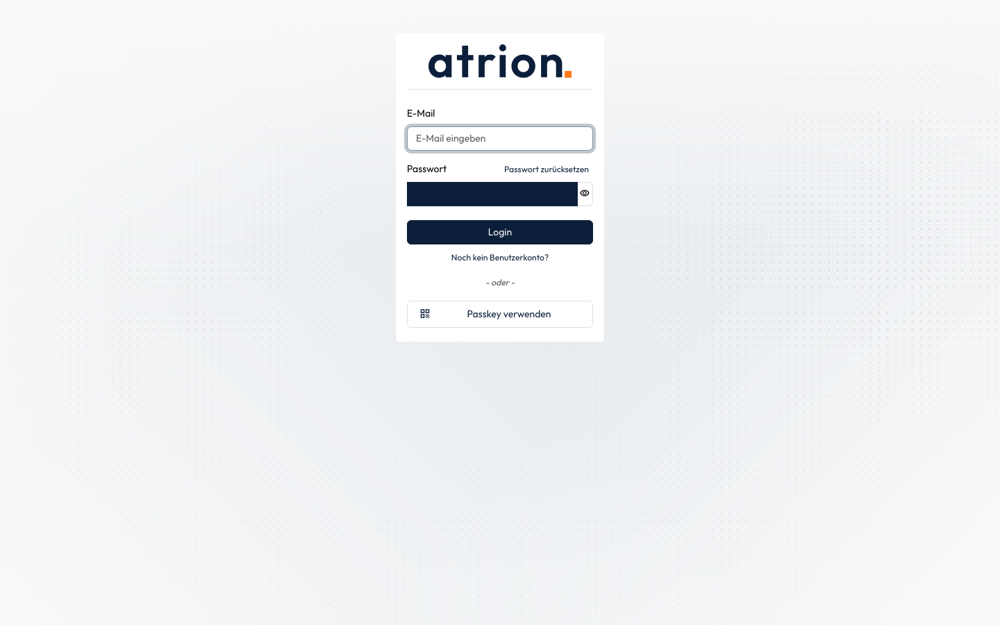
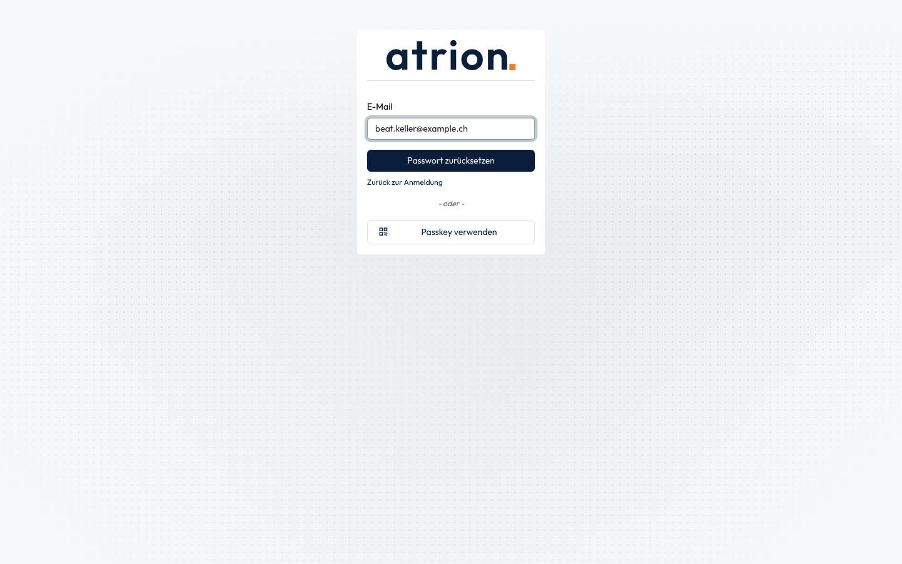

# Passwort zurücksetzen

Ein neues Passwort setzen, wenn du dein Passwort vergessen hast.

## Wer darf das

Alle Personen mit einem Benutzerkonto, ohne Anmeldung.

## Schritte

1. Klicke auf der Anmeldeseite neben **Passwort** auf **Passwort zurücksetzen**.

    

2. Gib deine E-Mail-Adresse ein und klicke auf **Passwort zurücksetzen**. Du erhältst eine E-Mail mit einem Link, über den du ein neues Passwort setzt.

    

## Hinweise

- Kommt keine E-Mail an, prüfe den Spam-Ordner oder wende dich an die Administration. Sie kann dein Passwort auch direkt setzen, siehe [Passwort einer Person zurücksetzen](passwort-fuer-andere-zuruecksetzen.md).
