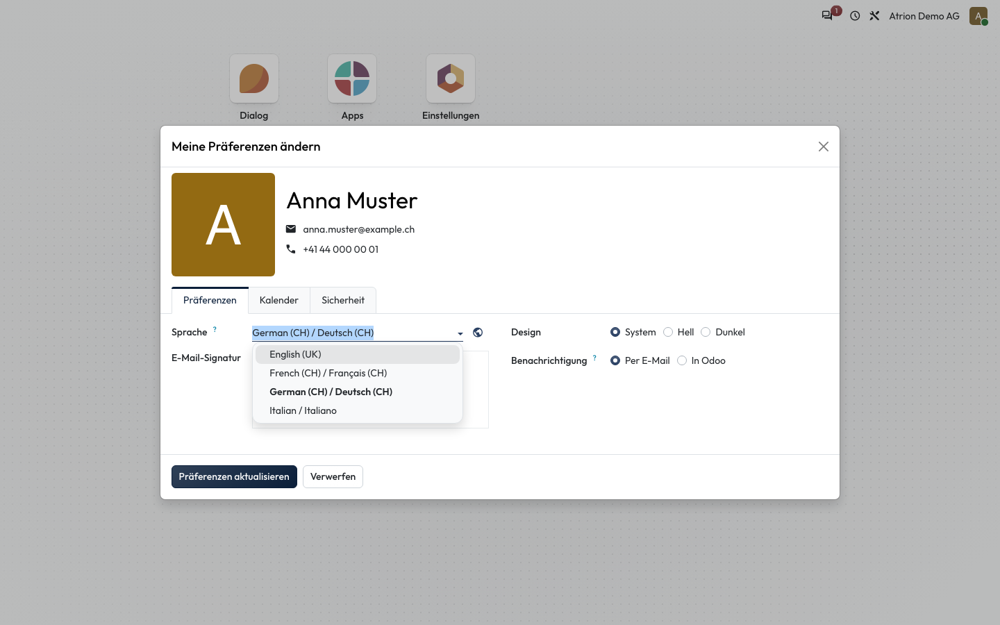

# Sprache wechseln

Die Sprache der Oberfläche für dich persönlich einstellen.

## Wer darf das

Alle angemeldeten Personen.

## Schritte

1. Klicke oben rechts auf dein Profilbild und wähle **Meine Präferenzen**.

    

2. Wähle unter **Sprache** die gewünschte Sprache und klicke auf **Präferenzen aktualisieren**.

    

## Hinweise

- Zur Auswahl stehen Deutsch (CH), Französisch (CH), Italienisch und Englisch (UK).
- Die Seite lädt nach dem Speichern neu und erscheint in der neuen Sprache.
