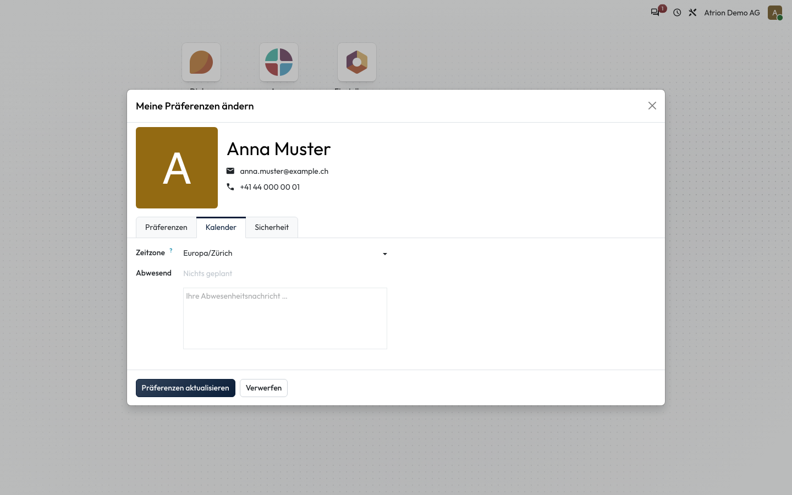

# Zeitzone einstellen

Die Zeitzone festlegen, in der Atrion Daten und Uhrzeiten anzeigt.

## Wer darf das

Alle angemeldeten Personen.

## Schritte

1. Öffne über dein Profilbild **Meine Präferenzen**, wechsle zum Reiter **Kalender**, wähle unter **Zeitzone** deine Zeitzone und klicke auf **Präferenzen aktualisieren**.

    

## Hinweise

- Standard ist Europa/Zürich.
- Im selben Reiter hinterlegst du unter **Abwesend** eine Abwesenheitsnachricht.
