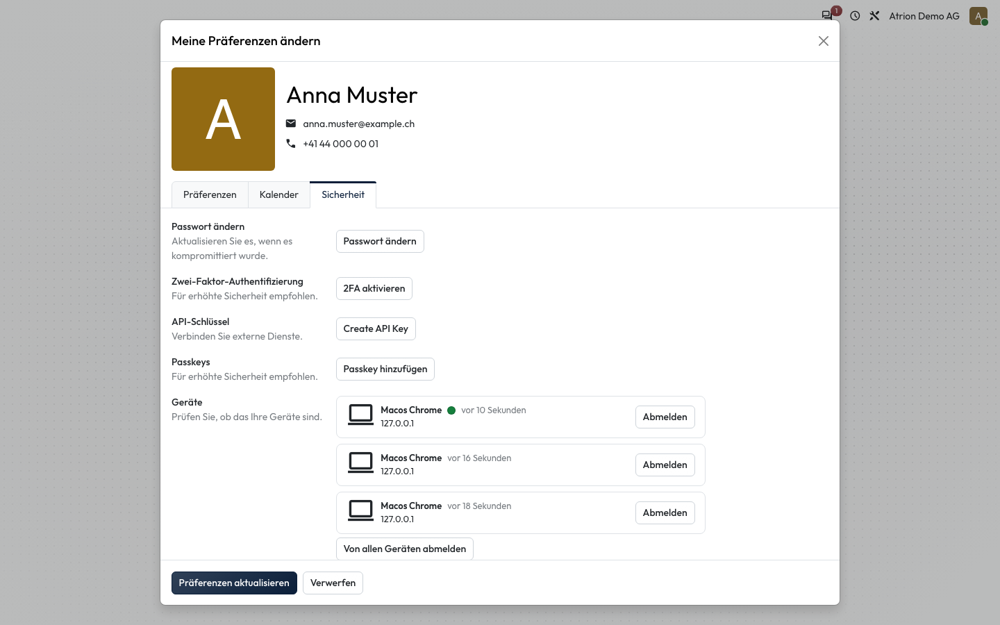
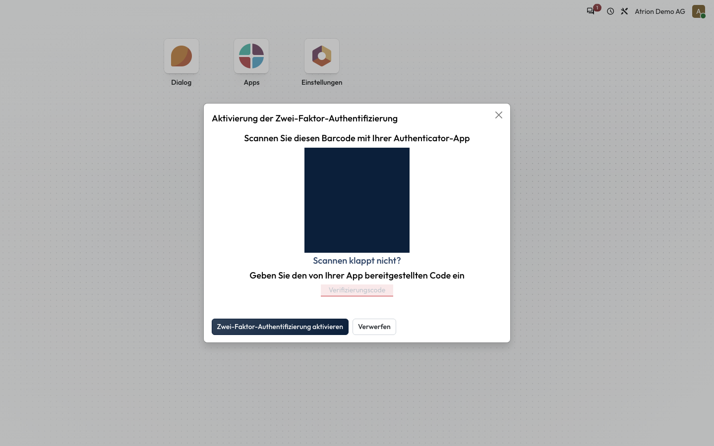

# Zwei-Faktor-Anmeldung einrichten

Das Konto zusätzlich mit einem Code aus einer Authenticator-App schützen.

## Wer darf das

Alle angemeldeten Personen.

## Schritte

1. Öffne über dein Profilbild **Meine Präferenzen**, Reiter **Sicherheit**, und klicke bei **Zwei-Faktor-Authentifizierung** auf **2FA aktivieren**. Bestätige danach mit deinem Passwort.

    

2. Scanne den Barcode mit deiner Authenticator-App, gib den angezeigten Code unter **Verifizierungscode** ein und klicke auf **Zwei-Faktor-Authentifizierung aktivieren**.

    

## Hinweise

- Geeignet sind zum Beispiel Microsoft Authenticator, Google Authenticator oder ein Passwortmanager mit Codes.
- Klappt das Scannen nicht, zeigt **Scannen klappt nicht?** den Schlüssel zum Abtippen.
- Ab der nächsten Anmeldung fragt Atrion nach dem Passwort auch nach dem Code.
