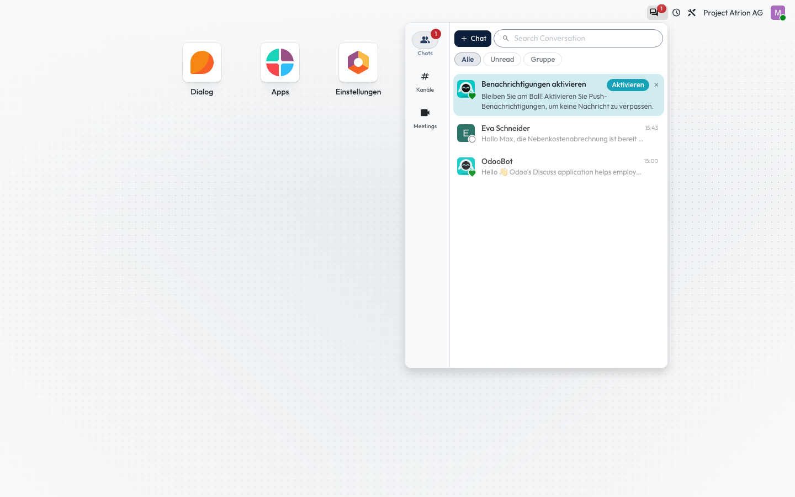

# Posteingang und Erwähnungen

Neue Nachrichten und Erwähnungen an einem Ort sehen.

## Wer darf das

Alle angemeldeten Personen.

## Schritte

1. Klicke oben rechts auf das Sprechblasen-Symbol. Die Zahl zeigt ungelesene Nachrichten; ein Klick auf einen Eintrag öffnet die Unterhaltung.

    

## Hinweise

- Unten im Menü wechselst du zwischen Chats, Kanälen und Meetings.
- Ob du zusätzlich eine E-Mail erhältst, stellst du unter [Benachrichtigungen](../persoenliche-einstellungen/benachrichtigungen.md) ein.
